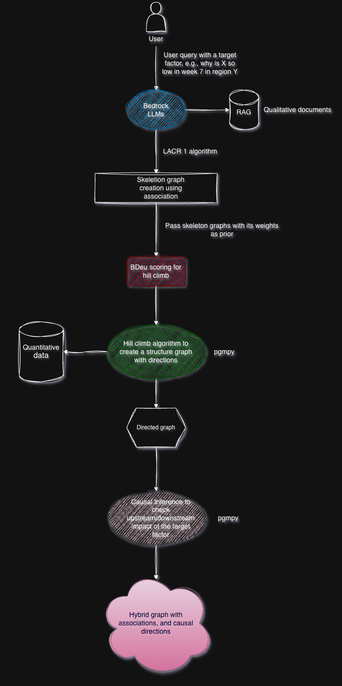
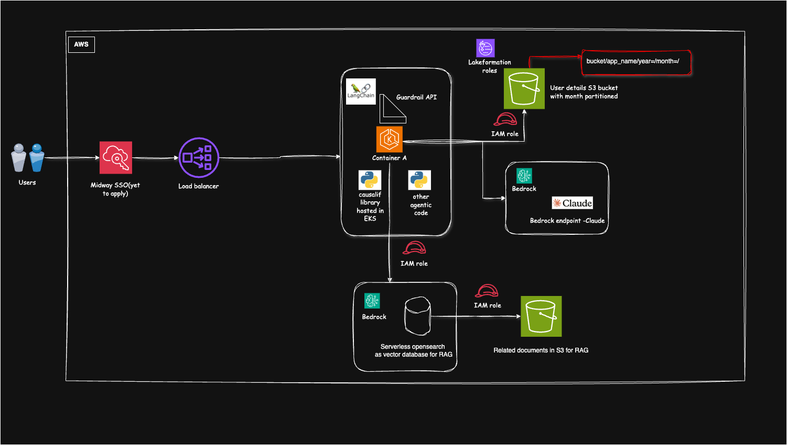

# Causal Inference Framework for AWS (causalif)

[](https://pypi.org/project/causalif/)
[](https://opensource.org/licenses/Apache-2.0)
[](https://www.python.org/downloads/)


---

## Table of Contents

1. [Overview](#overview)
2. [Logical Flow](#logical-flow)
3. [Why Hill Climb and BDeu Score?](#why-hill-climb-and-bdeu-score)
4. [Prerequisites](#prerequisites)
5. [Installation](#installation)
6. [Usage Examples](#usage-examples)
7. [Architecture](#architecture)
8. [Limitations](#limitations)
9. [Contributing](#contributing)
10. [License](#license)

## Overview

Causalif combines Large Language Models (LLMs) with Bayesian causal inference to discover causal relationships and associations from observational data and domain knowledge. Unlike traditional causal discovery algorithms that rely solely on statistical patterns, Causalif leverages:

- **Background Knowledge**: LLM's pre-trained knowledge about causal relationships
- **Document Knowledge**: Domain-specific documents retrieved via RAG
- **Statistical Evidence**: Correlation patterns from observational data
- **Bayesian Structure Learning**: Data-driven causal graph orientation

This hybrid approach enables causal discovery and associations even with limited data or when statistical methods alone are insufficient.

Note: LLM interpretation of causalif is best realised when this library is used as a tool in agentic systems.

**GitHub**: [awslabs/causalif](https://github.com/awslabs/causalif)  
**PyPI**: [causalif](https://pypi.org/project/causalif/)

---

## Ideal Use Cases

Causalif is particularly powerful when you have both qualitative domain knowledge and quantitative observational data. The library excels at discovering causal relationships between derived factors by combining: It is ideal to be integrated as a tool to agentic workflows so that the agent can interpret its results and provides an overall response to the user.

1. **Qualitative Knowledge**: Documents containing formulas, relationships, and domain expertise
2. **Quantitative Data**: Noisy observational data that fuels those formulas

### Example: Financial Analysis

**Scenario**: A financial institution wants to understand what drives the behavior of derived financial metrics.

**What They Have**:
- **Qualitative Finance Data**: Research papers, financial articles, analyst reports, and documents describing:
  - Derived formulas (e.g., "ROE = Net Income / Shareholder Equity")
  - Market relationships (e.g., "Interest rates affect bond prices inversely")
  - Economic theories and domain expertise
- **Quantitative Data**: Historical time-series data with noise:
  - Stock prices, trading volumes, interest rates
  - Company financials (revenue, earnings, debt ratios)
  - Market indicators (VIX, sector indices)

**What They Want to Discover**:
- Which factors causally drive a target metric (e.g., "Factors influencing volatility in Commodities?").
- Why any derived factors is low or high around a specific time period.
-What is causing a target factor to behave differently and what are influencing the target factor.


### Key Advantages for use Cases

1. **Handles Noisy Data**: Bayesian approach robust to measurement error and missing values
2. **Leverages Domain Knowledge**: RAG retrieval incorporates expert knowledge from documents
3. **Discovers Hidden Relationships**: Finds causal links not obvious from data alone
4. **Quantifies Effects**: Provides effect sizes, not just "yes/no" causality
5. **Validates with Multiple Sources**: Voting mechanism across LLM, documents, and data reduces false discoveries

### When Causalif is Most Effective

✅ **Use Causalif when you have**:
- Rich document corpus with domain knowledge and formulas
- Observational data (even if noisy or limited)
- Derived metrics whose dependencies are unclear
- Need to understand "what causes what" not just "what correlates"

⚠️ **Consider alternatives when**:
- You have no domain documents (pure data-driven methods may suffice)
- You need real-time causal discovery (Causalif requires LLM calls)
- Your data has <10 samples (insufficient for Bayesian structure learning)
- Relationships are purely experimental (randomized controlled trials are better)

---

## Logical Flow

Causalif implements a two-stage algorithm with parallel processing and RAG integration:

### Architecture Diagram



Causalif implements a three-stage algorithm:

### Stage 1: Edge Existence Verification (Causalif 1)

**Goal**: Determine which pairs of variables are causally related

**Process**:
1. **Initialize**: Start with a complete undirected graph (all possible edges between variables)
2. **Knowledge Base Assembly**: For each variable pair (A, B):
   - Query LLM's background knowledge
   - Retrieve relevant documents via RAG
   - Extract statistical evidence from data
3. **Voting Mechanism**: Each knowledge base votes on edge existence:
   - `+1`: Variables are associated (edge should exist)
   - `-1`: Variables are independent (edge should be removed)
   - `0`: Unknown (no vote)
4. **Edge Removal**: Remove edges where total vote score ≤ 0
5. **Output**: Skeleton graph (undirected graph of causal relationships)

**Parallel Optimization**: Causalif batches LLM queries for multiple variable pairs, executing them in parallel (configurable up to 50 concurrent queries) for significant speedup.

### Stage 2: Causal Orientation (Causalif 2)

**Goal**: Determine the direction of causal relationships (A → B or B ← A)

**Process**:
1. **Input**: Skeleton graph from Stage 1
2. **Bayesian Structure Learning**: 
   - Use Hill Climbing search with BDeu scoring
   - Constrain search to edges in skeleton (prior knowledge)
   - Weight edges by LLM confidence from Stage 1
3. **Direction Determination**: For each edge in skeleton:
   - Compute Bayesian posterior: P(G | Data, Priors) ∝ P(Data | G) × P(G | Priors)
   - Select direction that maximizes posterior probability
4. **Output**: Directed Acyclic Graph (DAG) representing causal relationships

**Degree-Limited Analysis**: Optionally focus on relationships within N degrees of separation from a target variable for faster analysis.

### Stage 3: Causal Inference (Optional)

**Goal**: Quantify causal effects and enable interventional queries

**Process**:
1. **Input**: Causal DAG from Stage 2 + Observational data
2. **Fit CPDs**: Learn Conditional Probability Distributions using Maximum Likelihood Estimation
3. **Create Bayesian Network**: Combine structure (DAG) with parameters (CPDs)
4. **Estimate Effects**: Compute Average Treatment Effects (ATE) for each cause
5. **Enable Queries**: Support interventional queries P(Y | do(X))
6. **Output**: Quantitative causal model with effect sizes

**When to Enable**:
- Need effect sizes ("how much does X affect Y?")
- Want to simulate interventions ("what if we change X?")
- Need to identify confounders and adjustment sets
- Require quantitative prioritization of causes

**Note**: This stage is optional and disabled by default. Enable with `enable_causal_inference=True` parameter.

---

## Why Hill Climb and BDeu Score?

### Why Hill Climbing?

**Hill Climbing** is a local search algorithm that iteratively improves a causal graph structure by:
- Starting from an initial graph (skeleton from Stage 1)
- Testing local modifications (add/remove/reverse edges)
- Accepting changes that improve the score
- Stopping at a local optimum

**Advantages for Causalif**:
1. **Constraint Compatibility**: Easily incorporates prior knowledge (skeleton graph) as hard constraints
2. **Computational Efficiency**: Scales to moderate-sized graphs (10-20 variables) with reasonable runtime
3. **Interpretability**: Local search steps are traceable and explainable
4. **Flexibility**: Supports custom scoring functions (like Prior-Weighted BDeu)

**Alternatives Considered**:
- **PC Algorithm**: Constraint-based, but doesn't naturally incorporate LLM priors
- **GES (Greedy Equivalence Search)**: Similar to Hill Climb but more complex
- **Exact Search**: Computationally prohibitive for >5 variables
- **MCMC Sampling**: More accurate but much slower; overkill for typical use cases

### Why BDeu Score?

**BDeu (Bayesian Dirichlet equivalent uniform)** is a Bayesian scoring function that measures how well a causal graph explains the observed data.

**Mathematical Foundation**:
```
BDeu(G, D) = P(D | G) = ∏ᵢ ∏ⱼ [Γ(α) / Γ(α + Nᵢⱼ)] × ∏ₖ [Γ(αₖ + Nᵢⱼₖ) / Γ(αₖ)]
```
Where:
- `G`: Causal graph structure
- `D`: Observational data
- `α`: Equivalent sample size (prior strength)
- `Nᵢⱼₖ`: Count of observations in configuration

**Advantages for Causalif**:
1. **Bayesian Framework**: Naturally combines prior knowledge (LLM) with data evidence
2. **Score Equivalence**: Assigns same score to equivalent graph structures (Markov equivalence)
3. **Regularization**: Built-in penalty for complex graphs (Occam's razor)
4. **Theoretical Soundness**: Proven consistency properties as data grows

**Causalif Enhancement - Prior-Weighted BDeu**:
```python
Score(G) = BDeu(G | Data) + λ × Prior(G | LLM)
```
Where:
- `BDeu(G | Data)`: Standard BDeu score from data
- `Prior(G | LLM)`: LLM confidence scores from Stage 1
- `λ`: Weight parameter balancing data vs. prior

This implements true Bayesian inference: **P(G | Data, LLM) ∝ P(Data | G) × P(G | LLM)**

**Alternatives Considered**:
- **BIC (Bayesian Information Criterion)**: Simpler but less theoretically principled
- **AIC (Akaike Information Criterion)**: Doesn't incorporate priors naturally
- **K2 Score**: Similar to BDeu but requires variable ordering
- **MIT Score**: More complex, no clear advantage for this use case

---

## Prerequisites

### 1. AWS Bedrock Knowledge Base

Causalif requires a RAG knowledge base for document retrieval. Set up an AWS Bedrock Knowledge Base following the [official instructions](https://docs.aws.amazon.com/bedrock/latest/userguide/knowledge-base-create.html).

**Recommended Configuration**:
- **Vector Store**: Amazon OpenSearch Serverless or Amazon Aurora
- **Embedding Model**: Amazon Titan Embeddings or Cohere Embed
- **Document Format**: Markdown, PDF, or plain text
- **Number of Results**: 10-20 documents per query

### 2. Create Retriever Tool

After setting up the knowledge base, create a LangChain retriever tool:

```python
from langchain_aws.retrievers import AmazonKnowledgeBasesRetriever
from langchain.tools.retriever import create_retriever_tool

retriever = AmazonKnowledgeBasesRetriever(
    knowledge_base_id="<your-knowledge-base-id>",
    retrieval_config={
        "vectorSearchConfiguration": {
            "numberOfResults": 20  # Adjust based on your needs
        }
    },
)

retriever_tool = create_retriever_tool(
    retriever,
    "domain_knowledge_retriever",
    "Retrieves domain-specific documents about causal relationships between factors",
)
```

### 3. LLM Model

Causalif works with any LangChain-compatible LLM. AWS Bedrock is recommended:

```python
from langchain_aws import ChatBedrock

model = ChatBedrock(
    model_id="anthropic.claude-3-sonnet-20240229-v1:0",
    region_name="us-east-1",
    model_kwargs={
        "temperature": 0.0,  # Deterministic for causal reasoning
        "max_tokens": 4096
    }
)
```

**Supported Models**:
- Anthropic Claude (recommended)
- Amazon Titan
- Meta Llama
- Cohere Command
- Any OpenAI-compatible model

### 4. Observational Data

Provide a pandas DataFrame with observational data:

```python
import pandas as pd

df = pd.DataFrame({
    'sleep_hours': [7, 6, 8, 5, 7, 9],
    'exercise_minutes': [30, 20, 45, 10, 35, 60],
    'stress_level': [5, 7, 3, 8, 4, 2],
    'productivity': [8, 6, 9, 4, 7, 10]
})
```

**Requirements**:
- Minimum 100 samples (more is better)
- Numeric or categorical columns
- No missing values (or handle them beforehand)

---

## Installation

```bash
pip install causalif
```

---

## Usage Examples

### Basic Usage

```python
from causalif import set_causalif_engine, causalif_tool, visualize_causalif_results
from langchain_aws import ChatBedrock
import pandas as pd

# 1. Prepare your data
df = pd.DataFrame({
    'sleep_hours': [7, 6, 8, 5, 7, 9, 6, 8, 7, 5],
    'exercise_minutes': [30, 20, 45, 10, 35, 60, 25, 50, 40, 15],
    'stress_level': [5, 7, 3, 8, 4, 2, 6, 3, 5, 8],
    'productivity': [8, 6, 9, 4, 7, 10, 6, 9, 8, 5]
})

# 2. Initialize LLM
model = ChatBedrock(
    model_id="anthropic.claude-3-sonnet-20240229-v1:0",
    model_kwargs={"temperature": 0.0}
)

# 3. Configure Causalif engine
# Configure with financial data

set_causalif_engine(
            model=<your_bedrock_model>,
            retriever_tool=retriever_tool,
            dataframe=<dataframe_name>, 
            max_degrees=<degree of edges>,  # None = no filtering (show entire graph), or set to int (e.g., 2) to filter.
            max_parallel_queries=50, #This is variable but the code is tested with 50.
            excluded_target_columns=None, # This a list of factors that shouldn't be target columns
            excluded_related_columns=None, # This a list of factors that shouldn't be related columns
            related_factors=None,  # Add custom related factors here (will be appended with dataframe columns). Mostly derived columns from documents
            selected_dataframe_columns=None, # list of columns from your dataframe if you dont want the whole dataframe to be analyzed.
            enable_causal_estimate = True  #Causal inference to find upstream or downstream direct effects of the target factor.
        )

# 4. Run causal analysis
result = causalif.causalif("Why is interest_rate so low in week 3?")

# 5. Visualize results
fig = visualize_causalif_results(result)
fig.show()

```


### Query Formats

Causalif supports natural language queries in various formats. The `<target_factor>` is the column or factor whose dependencies with other variables you want to analyze:

```python
"""
Allowed query formats (where <target_factor> is the variable to analyze):

1. why (is|are) <target_factor> so (low|high|poor|bad|good)
2. what (causes|affects|influences) <target_factor>
3. <target_factor> (is|are) too (low|high)
4. analyze the causes (of|for) <target_factor>
5. dependencies (of|for) <target_factor>
6. factors (affecting|influencing) <target_factor>
"""

# Format 1: Why questions
result = causalif.causalif("Why is stress_level so high?")
result = causalif.causalif("Why are sales so low?")

# Format 2: What causes questions
result = causalif.causalif("What causes low productivity?")
result = causalif.causalif("What affects customer satisfaction?")

# Format 3: Direct statements
result = causalif.causalif("productivity is too low")
result = causalif.causalif("revenue is too high")

# Format 4: Analysis requests
result = causalif.causalif("analyze the causes of high stress_level")
result = causalif.causalif("analyze the causes for poor performance")

# Format 5: Dependency queries
result = causalif.causalif("dependencies of productivity")
result = causalif.causalif("dependencies for stock_price")

# Format 6: Factor influence queries
result = causalif.causalif("factors affecting sleep_hours")
result = causalif.causalif("factors influencing market_volatility")
```


### Visualization Features

The interactive visualization includes:

- **Node Colors**: Degree of separation from target factor (red = direct, blue = distant)
- **Edge Colors**: Same color scheme as nodes
- **Arrows**: Direction of causality
- **Hover Information**: Detailed relationship information
- **Interactive**: Zoom, pan, and click for details

```python
fig = visualize_causalif_results(result)

# Customize visualization
fig.update_layout(
    title="Custom Title",
    width=1200,
    height=800
)

# Save to file
fig.write_html("causal_graph.html")
fig.write_image("causal_graph.png")  # Requires kaleido
```

---

## Architecture

### System Integration



Causalif integrates with agentic LLM applications as a tool:

1. **Agent Layer**: LangChain agents or custom orchestrators
2. **Causalif Tool**: Exposes `causalif_tool` for natural language queries
3. **Engine Layer**: `CausalifEngine` implements core algorithms
4. **Knowledge Layer**: RAG retriever + LLM background knowledge
5. **Data Layer**: Pandas DataFrame with observational data

### Component Architecture

```
causalif/
├── core.py           # Data structures (AssociationResponse, CausalDirection, KnowledgeBase)
├── engine.py         # CausalifEngine (main algorithm implementation)
├── prompts.py        # CausalifPrompts (LLM prompt templates)
├── tools.py          # causalif_tool, set_causalif_engine (LangChain integration)
├── visualization.py  # visualize_causalif_results (Plotly graphs)
└── __init__.py       # Public input exports
```

### Key Classes

**CausalifEngine**:
- `causalif_1_edge_existence_verification()`: Stage 1 algorithm
- `causalif_2_orientation()`: Stage 2 algorithm
- `run_complete_causalif()`: End-to-end pipeline
- `batch_association_queries()`: Parallel LLM queries
- `batch_causal_direction_queries()`: Parallel direction queries
- `visualize_graph()`: Visualization

**KnowledgeBase**:
- `kb_type`: "BG" (background), "DOC" (document)
- `content`: Knowledge content
- `source`: Source identifier

---

## Limitations

### This method isn't ideal for only qualtitative data and requirements with feedback loops. This method is built aiming finding hybrid association and causality among qualitative and quatitative data sets. 

### Data & Computational

- **Minimum 10 samples** required for Bayesian structure learning (100+ recommended)
- **Scalability**: Practical limit of 15-20 variables without degree filtering
- **Time Complexity**: O(n² × k) for n variables and k LLM queries per pair
- **LLM Costs**: 2-5 LLM calls per variable pair

**Mitigation**: Use `max_degrees` parameter to focus analysis; increase `max_parallel_queries` for speed.

### LLM & Knowledge

- **Hallucination**: LLM may invent unsupported relationships
- **Bias**: Reflects training data biases
- **Consistency**: Results may vary (use `temperature=0` for determinism)
- **RAG Quality**: Results depend on document corpus quality and retrieval accuracy

**Mitigation**: Validate outputs with domain expertise; use voting across multiple knowledge sources.

### Causal Assumptions

- **Acyclicity**: Assumes DAG structure (no feedback loops)
- **Causal Sufficiency**: Assumes no unmeasured confounders
- **Markov Condition**: Assumes conditional independence given parents

**Mitigation**: Include potential confounders in variable set; validate DAG assumption with domain knowledge.

---

## Contributing

We welcome contributions! Please see [CONTRIBUTING.md](CONTRIBUTING.md) for guidelines.

### Reporting Issues

Please report bugs and feature requests on [GitHub Issues](https://github.com/awslabs/causalif/issues).

---

## License

This project is licensed under the Apache-2.0 License. See [LICENSE](LICENSE) for details.


## Version History

-- **v0.1.9.1**: Remeved LLM based causal directions and introduced bayesian based causal direction with hill climb search and immediate upstream and downstream effects. Building a hybrid graph with associations and causal directions.
- **v0.1.6**: Removed directed graph dependencies, added example notebook.
- **v0.1.5**: README updates.
- **v0.1.4**: Base version with complete Causalif algorithm.

---

## Support

- **Documentation**: [GitHub README](https://github.com/awslabs/causalif/blob/main/README.md)
- **Issues**: [GitHub Issues](https://github.com/awslabs/causalif/issues)
- **Email**: bossubhr@amazon.co.uk

---

## Acknowledgments

Built with:
- [LangChain](https://github.com/langchain-ai/langchain) - LLM orchestration
- [NetworkX](https://networkx.org/) - Graph algorithms
- [Plotly](https://plotly.com/) - Interactive visualization
- [AWS Bedrock](https://aws.amazon.com/bedrock/) - LLM and RAG infrastructure
