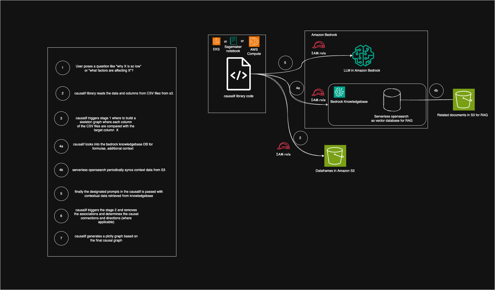
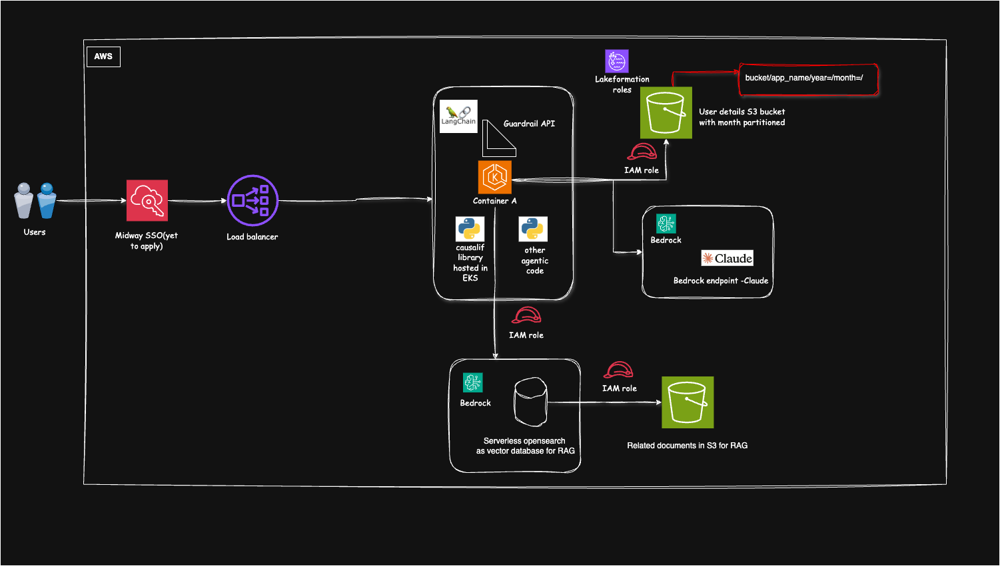

# Causal Inference Framework for AWS (causalif)

LLM assisted causal reasoning library built with JAX and RAG. Designed primarily for agentic LLM applications, this library can also be used standalone in Jupyter notebooks with access to Bedrock.

github: https://github.com/awslabs/causalif  
pypi: https://pypi.org/project/causalif/

# Architecture and usage in applications




# Example usage

example notebook: https://github.com/awslabs/causalif/blob/subhro/bug_fix/examples/causalif.ipynb

# Prerequisites

This library is based on RAG; it requires a knowledgebase to be ready before using this library. Below steps are required to be performed before using this library.

### Step-1:

You can set up a bedrock knowledgebase following the [instructions](https://docs.aws.amazon.com/bedrock/latest/userguide/knowledge-base-create.html).

### Step-2:

After setting up a knowledgebase, you can create a retriever tool like the following:

<pre>```python
from langchain_aws.retrievers import AmazonKnowledgeBasesRetriever
from langchain.tools.retriever import create_retriever_tool

retriever = AmazonKnowledgeBasesRetriever(
    knowledge_base_id="<knowledge-base-id>",
    retrieval_config={
        "vectorSearchConfiguration": {
            "numberOfResults": 20 #it could be any of your desired number
        }
    },
)

retriever_tool = create_retriever_tool(
    retriever,
    "<name of the retriever tool>",
    "<Description of the retriever tool>",
)```</pre>

# Installation

<pre>```bash
pip install causalif
```</pre>

# QuickStart

<pre>```python
from causalif import set_causalif_engine, causalif_tool, visualize_causalif_results
from langchain_aws import ChatBedrock
```</pre>

## Configure the engine

<pre>```python
set_causalif_engine(
model=your_model,       #Bedrock or any other provider. Please import the provider if it is other than Bedrock.
retriever_tool=retriever_tool,      # retriever_tool from prerequisites.
dataframe=your_dataframe,       # if you want all columns of your dataframe to be considered in causal analysis. Otherwise, leave it as 'None'.
factors = list of factors,      # list of your factors, e.g., ['water', 'food', 'exercise'].
domains = list of domains,      # list of your domains, e.g., ['life', 'health', 'well being'].
max_degrees=1,      # degrees of relationships that you wish to check.
max_parallel_queries=10         # it could be between 4 to 50 but it depends on the model throughput.
)
```</pre>

## Use the tool

<pre>```python
result = causalif_tool("Why is water so low in body after we wake up?")
```</pre>

<pre>```python
"""
Allowed formation of enqueries (<\target_factor> is the column or factor whose dependencies with other variables we want to analyze):

1. why (is|are) <\target_factor> so (low|high|poor|bad|good),
2. what (causes|affects|influences) <\target_factor>,
3. <\target_factor> (is|are) too (low|high)",
4. analyze the causes (of|for) <\target_factor>,
5. dependencies (of|for) <\target_factor>,
6. factors (affecting|influencing) <\target_factor>
"""
```</pre>

## Visualize results

<pre>```python
fig = visualize_causalif_results(result)
fig.show()
```</pre>

## Security

See [CONTRIBUTING](CONTRIBUTING.md#security-issue-notifications) for more information.

## License

This project is licensed under the Apache-2.0 License.
