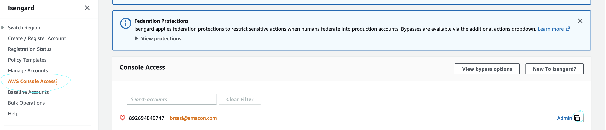
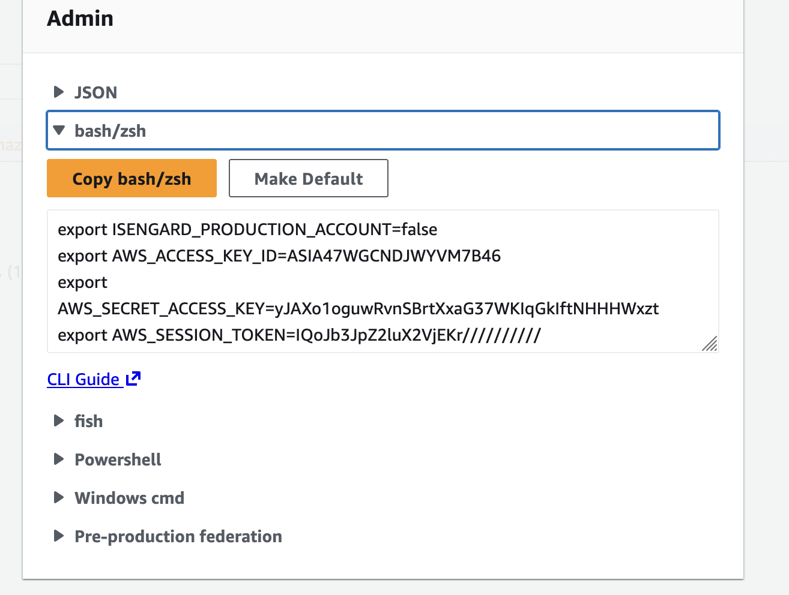
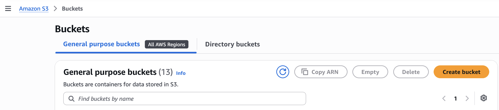
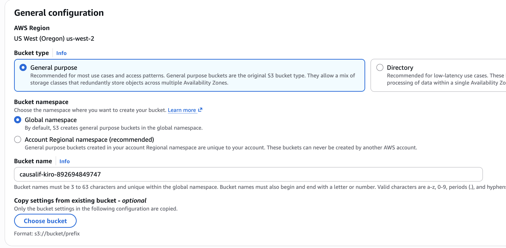

# CausalIF Auto MPG Demo — Kiro User Guide

This guide walks you through running the **CausalIF Auto MPG demo notebooks**
(`causalif-mpg-demo.ipynb` and `causalif-byo-data.ipynb`) end-to-end inside the
**Kiro IDE**, using your own AWS account accessed via Isengard or Conduit.

It answers the business question *"What factors influence MPG in cars?"* using the
[CausalIF](https://github.com/awslabs/causalif) framework and Amazon Bedrock — all
from a Jupyter notebook running in your local Kiro workspace, with AWS calls routed
through temporary credentials you paste into the terminal.

> **Who this is for.** Amazon builders who have access to an AWS account via
> [Isengard](https://isengard.amazon.com/) or
> [Conduit](https://conduit.amazon.com/), are comfortable using the Kiro IDE,
> and want to run CausalIF locally rather than inside SageMaker Studio.

---

## What you'll do

1. **Connect to AWS** from the Kiro terminal using Isengard or Conduit credentials.
2. **Create an S3 bucket** and upload the knowledge-base reference documents.
3. **Create an Amazon Bedrock Knowledge Base** pointed at that bucket (optional but recommended).
4. **Download the dataset** and open the notebook.
5. **Run the notebook** — CausalIF performs causal discovery and renders the interactive graph.
6. **Clean up** AWS resources when you're done.

```
Your Kiro IDE (local machine)
└── Jupyter kernel (Python 3.11+)
     └── causalif-mpg-demo.ipynb  (or causalif-byo-data.ipynb)
          │  sets up and calls:
          ├── Amazon Bedrock (Claude via ChatBedrockConverse)
          ├── Amazon Bedrock Knowledge Base (RAG retriever)
          └── Amazon S3 (document storage for Knowledge Base)
                   ▲
          AWS credentials injected via terminal
          (Isengard / Conduit access keys)
```

---

## Prerequisites (read first)

- **Kiro IDE installed** on your machine with a Python 3.11+ kernel available.
- **An AWS account** reachable via Isengard or Conduit with permissions for
  Amazon Bedrock, S3, and IAM. If you are unsure, confirm with your account
  admin before starting.
- **AWS CLI installed** locally (`aws --version`). If not installed, follow the
  [AWS CLI install guide](https://docs.aws.amazon.com/cli/latest/userguide/getting-started-install.html).
- **Python 3.11+** available in your environment. Kiro ships with a Python
  extension; alternatively use a virtualenv or conda environment.
- **The workshop files downloaded** into a local folder you'll open in Kiro.
  You only need the three files from this demo — no need to clone the whole repo.
  Download them from the GitHub UI or run these commands in the Kiro terminal:
  ```bash
  mkdir -p causalif-workshop/examples/analyticon/auto-mpg
  cd causalif-workshop/examples/analyticon/auto-mpg
  BASE=https://raw.githubusercontent.com/awslabs/causalif/main/examples/analyticon/auto-mpg
  curl -fsSL -o causalif-mpg-demo.ipynb   "$BASE/causalif-mpg-demo.ipynb"
  curl -fsSL -o causalif-byo-data.ipynb   "$BASE/causalif-byo-data.ipynb"
  curl -fsSL -o USER-GUIDE-KIRO.md        "$BASE/USER-GUIDE-KIRO.md"
  ```
  Then open the `causalif-workshop` folder in Kiro (**File → Open Folder**).

  > **GitHub UI alternative:** go to
  > [github.com/awslabs/causalif/tree/main/examples/analyticon/auto-mpg](https://github.com/awslabs/causalif/tree/main/examples/analyticon/auto-mpg),
  > open each file, click **Raw**, and save to your local folder with
  > **File → Save Page As**.

> **Region note.** This guide defaults to **`us-west-2`**, which supports Amazon
> Bedrock managed Knowledge Bases and the default Claude model. If you use a
> different Region, make sure it supports both managed KBs and your chosen
> `BEDROCK_MODEL_ID`, and update `AWS_REGION` in the notebook parameters (Step 4).

---

## 1. Connect to AWS from the Kiro terminal

Kiro provides an integrated terminal. All AWS CLI and Python SDK calls made from
a notebook cell running inside Kiro inherit the environment variables set in that
terminal session.

### Option A — Isengard credentials (recommended for Amazon employees)

1. Open a terminal in Kiro: **View → Terminal** (or the terminal icon in the
   activity bar).
2. Navigate to [Isengard](https://isengard.amazon.com/), find the account you
   want to use, and choose **Access Keys**.
   
   
3. Copy the **short-term credentials block** (three `export` lines) and paste it
   directly into the Kiro terminal:

   
   
4. Optionally set your default region so you don't have to specify it on every CLI call:
   ```bash
   export AWS_DEFAULT_REGION=us-west-2
   ```
5. Verify the credentials are working:
   ```bash
   aws sts get-caller-identity
   ```
   You should see a JSON response with your `Account`, `UserId`, and `Arn`.

> **Credential expiry.** Isengard short-term credentials expire after 1 hour. If
> you get `ExpiredTokenException` mid-run, go back to Isengard, copy fresh
> credentials, and re-export them in the same terminal. Then restart the Jupyter
> kernel (**Kernel → Restart Kernel**) and re-run from the top.

### Option B — Conduit credentials

1. Open a terminal in Kiro.
2. Run `conduit` to authenticate:
   ```bash
   ada creds update --account <ACCOUNT_ID> --provider conduit --role <ROLE_NAME>
   ```
   This writes temporary credentials into `~/.aws/credentials` under a named
   profile. Check the output for the profile name (usually `default` or
   `<ACCOUNT_ID>_<ROLE_NAME>`).
3. If Conduit writes to a non-default profile, export it so the notebook picks it up:
   ```bash
   export AWS_PROFILE=<profile_name>
   ```
4. Confirm:
   ```bash
   aws sts get-caller-identity
   ```

### Verify Bedrock access

While you have the terminal open, confirm your role can invoke Bedrock models in
`us-west-2`:
```bash
aws bedrock list-foundation-models --region us-west-2 --query "modelSummaries[?contains(modelId,'claude')].modelId" --output text | head -5
```
If this returns Claude model IDs, your credentials have Bedrock access. If you
get `AccessDeniedException`, contact your account admin to attach the appropriate
Bedrock IAM permissions to your role.

**Checkpoint:** `aws sts get-caller-identity` returns your account details, and
Bedrock model listing succeeds.

---

## 2. Create an S3 bucket and upload the knowledge-base documents

The CausalIF Knowledge Base needs two reference documents stored in S3:
`fuel_economy_primer.md` and `epa_trends_report.pdf`. This step creates a
bucket via the AWS console and then uploads the files from the Kiro terminal.

> **Keep your Region consistent.** Create the bucket in the same Region as your
> Knowledge Base (Step 3) and the notebook's `AWS_REGION` — this guide uses
> **us-west-2** throughout.

### Step 2.1 — Create the S3 bucket in the console

1. Sign in to the [AWS console](https://console.aws.amazon.com/) and confirm the
   Region in the top-right is **US West (Oregon) / us-west-2**.
2. In the search bar type **S3** and open **Amazon S3**.
3. Choose **Create bucket**.

4. **Bucket name:** enter a globally unique name. A reliable pattern is:
   ```
   causalif-kiro-<your-12-digit-account-id>
   ```
   Your account ID is visible in the top-right of the console (click your name).
   Example: `causalif-kiro-123456789012`.
   
5. **AWS Region:** confirm it is set to **US West (Oregon) us-west-2**.
6. **Block Public Access settings:** leave all four options **checked** (on by
   default). The Knowledge Base accesses the bucket through an IAM service role,
   not public access.
7. Leave all other settings at their defaults and choose **Create bucket**.
8. The console returns you to the bucket list. Your new bucket should appear with
   **Access** showing **Bucket and objects not public**.

**Note the bucket name** — you will use it in the terminal commands below and
in the Knowledge Base data source URI (Step 3).

### Step 2.2 — Download the reference documents and upload to the bucket

Run the following commands in the **Kiro terminal** (same session where your
AWS credentials are set from Step 1). Replace `<YOUR-BUCKET-NAME>` with the
name you chose above.

```bash
# Set variables — replace with your actual bucket name and region
REGION=us-west-2

# Look up your AWS account number (no need to type it in)
ACCOUNT_ID=$(aws sts get-caller-identity --query Account --output text)

# Derive a unique bucket name from the account number.
BUCKET=causalif-kiro-$ACCOUNT_ID
REGION=us-west-2

# Download the reference documents from the public GitHub repo
mkdir -p kb-docs
BASE=https://raw.githubusercontent.com/awslabs/causalif/main/examples/analyticon/auto-mpg/knowledge-base
curl -fsSL -o kb-docs/fuel_economy_primer.md "$BASE/fuel_economy_primer.md"
curl -fsSL -o kb-docs/epa_trends_report.pdf  "$BASE/epa_trends_report.pdf"

# Upload them to your bucket under a knowledge-base/ prefix
aws s3 cp kb-docs/ s3://$BUCKET/knowledge-base/ --recursive

# Confirm the upload
aws s3 ls s3://$BUCKET/knowledge-base/
```

You should see both files listed. You can also add your own domain documents
(PDF, TXT, Markdown) to the same prefix — for this MPG example, documents
explaining how engine size, weight, and horsepower affect fuel economy work well.

**Checkpoint:** The S3 bucket exists in us-west-2, and
`aws s3 ls s3://$BUCKET/knowledge-base/` lists
`fuel_economy_primer.md` and `epa_trends_report.pdf`.

---

## 3. Create the Amazon Bedrock Knowledge Base (optional)

This step grounds CausalIF's reasoning in the uploaded domain documents. If you
skip it, CausalIF still works using the LLM's background knowledge alone — just
leave `KNOWLEDGE_BASE_ID = None` in the notebook parameters (Step 4).

You can create the Knowledge Base two ways: via the AWS console (simpler, no code)
or via the CLI.

### Option A — AWS console (recommended for first-time setup)

1. Open the **Amazon Bedrock console** → left nav → under **Build**,
   choose **Knowledge Bases** → **Create Managed KB**.
   
2. **Name** the KB (e.g. `causalif-mpg-kb`).
3. **IAM permissions:** let the console **create and use a new service role**.
4. **Data source:** choose **Amazon S3** and set the S3 URI to your uploaded
   prefix: `s3://<your-bucket>/knowledge-base/`. If you need the exact name, run
   `echo s3://$BUCKET/knowledge-base/` in the terminal from Step 2.2, or use
   **Browse S3** to pick the `causalif-analyticon2026-<account-id>` bucket.
5. Review and choose **Create Knowledge Base**. Provisioning takes a few minutes;
   wait for the status to become **Available** and Sync completed.

6.On the Knowledge Base overview page, copy the **Knowledge Base ID** (a short
string like `ABCD1234EF`).


## 4. Download the dataset and open the notebook in Kiro

### Get the Auto MPG dataset (required)

The demo notebook reads `auto-mpg.data`. Download it from the UCI Machine
Learning Repository and place it **in the same folder as the notebook**:

```bash
# Run in the Kiro terminal — navigate to the folder where you saved the notebooks
cd causalif-workshop/examples/analyticon/auto-mpg

curl -fsSL -o auto+mpg.zip https://archive.ics.uci.edu/static/public/9/auto+mpg.zip
unzip -o auto+mpg.zip auto-mpg.data
```

Confirm `auto-mpg.data` is in the same folder as `causalif-mpg-demo.ipynb`.

### Open the notebook

In the Kiro file explorer, navigate to your workshop folder and open:

```
causalif-workshop/examples/analyticon/auto-mpg/causalif-mpg-demo.ipynb
```

Click to open it. Kiro will launch a Jupyter kernel for the file.

> **BYO data notebook:** If you want to run CausalIF on your own dataset,
> open `causalif-byo-data.ipynb` in the same folder. It follows the same
> steps but with a generic CSV loader and configurable column/factor settings.

### Set the notebook parameters

Look for the **Section 3 configuration cell** near the top of the notebook
(labeled `# --- Configurable settings ---`). Update these values:

| Parameter | What to set |
|---|---|
| `AWS_REGION` | Your Region. Default `"us-west-2"`. Must match where your bucket and KB live. |
| `BEDROCK_MODEL_ID` | A current Claude model ID. Default `"us.anthropic.claude-sonnet-4-5-20250929-v1:0"`. For EU Regions use the matching `eu.` inference profile. |
| `KNOWLEDGE_BASE_ID` | Paste the KB ID from Step 3 (e.g. `"ABCD1234EF"`), or leave as `None` to run on background knowledge only. |

> **Credential note for local notebooks.** Unlike SageMaker Studio, your
> notebook kernel does **not** automatically inherit an IAM role. It uses
> the credentials from the environment where the kernel started. Make sure you
> launched Kiro (or the terminal that started the kernel) with the AWS
> environment variables exported in Step 1 still active. If you get
> `NoCredentialsError`, re-export the credentials in the terminal and restart
> the kernel.

**Checkpoint:** `auto-mpg.data` is in the notebook folder, the notebook is open
in Kiro, and the configuration cell has the correct Region, model ID, and
(optionally) KB ID.

---

## 5. Run the notebook

Run the cells **top to bottom, in order**. Each section produces output the next
depends on.

**How to run:**
- **Run All Cells:** from the menu, **Run → Run All Cells**.
- **Step through:** click into the first cell and press **Shift + Enter** to run
  one cell at a time (recommended your first time — lets you watch each stage).

### What each section does

| Section | What happens |
|---|---|
| **1–2. Install & import** | Installs `causalif` and `langchain-aws`, then imports them. **You may need to restart the kernel once** after install (`Kernel → Restart Kernel`), then re-run from the top. |
| **3. Configuration** | Prints the Region, model ID, and Knowledge Base ID (or `none — background knowledge only`). |
| **4. Load data** | Reads `auto-mpg.data`, cleans it, and prints the analysis factors and row count. |
| **5. Retriever** | If `KNOWLEDGE_BASE_ID` is set, creates the Bedrock Knowledge Base retriever. Otherwise prints that it is skipped. |
| **6. Configure engine** | Calls `set_causalif_engine(...)` with the LLM, retriever, dataframe, and domains. Prints engine configuration. |
| **7. Run causal analysis** | Calls `causalif("what influences mpg")`. This is the main computation — it makes multiple Bedrock calls per factor pair. Expect a few minutes. |
| **8. Visualise** | Renders the interactive Plotly causal graph directly in the notebook output. |
| **9. Save** | Writes `result.json` next to the notebook. |

### Signs the run is healthy

- Section 6 prints `CausalIF engine configured with Bayesian causal inference`.
- Section 7 starts printing `CausalIF 1: Edge Existence Verification` log lines —
  this is the main LLM loop running factor-pair queries.
- Section 8 renders a coloured graph with arrows showing causal directions.

**Checkpoint:** The notebook ran to the end and the causal graph is visible in
Section 8.

---

## 6. Using the BYO data notebook (`causalif-byo-data.ipynb`)

The BYO data notebook is a generic template for running CausalIF on your own CSV.
Open it in Kiro from `causalif-workshop/examples/analyticon/auto-mpg/causalif-byo-data.ipynb` and
update the configuration cell:

```python
# --- Configurable settings ---
AWS_REGION          = "us-west-2"
BEDROCK_MODEL_ID    = "us.anthropic.claude-sonnet-4-5-20250929-v1:0"
KNOWLEDGE_BASE_ID   = None          # or paste your KB ID
DATA_PATH           = "your-data.csv"
TARGET_FACTOR       = "your_target_column"
DOMAINS             = ["your domain", "e.g. finance", "supply_chain"]
```

Place your CSV file in the same folder as the notebook (or provide an absolute
path). For S3-stored data, you can read it with:

```python
import boto3, io, pandas as pd

s3 = boto3.client("s3", region_name=AWS_REGION)
obj = s3.get_object(Bucket="your-bucket", Key="path/to/your-data.csv")
df = pd.read_csv(io.BytesIO(obj["Body"].read()))
```

For `factor_descriptions` (strongly recommended — see below), store a Markdown
file in S3 and point the engine at it:

```python
set_causalif_engine(
    ...
    factor_descriptions="s3://your-bucket/causalif/factor_descriptions.md",
)
```

The file should list each column with a plain-English definition, for example:

```markdown
# Factor Definitions
- cylinders: number of engine cylinders
- displacement: engine displacement in cubic inches
- horsepower: engine output power in hp
- weight: vehicle weight in pounds
- acceleration: 0-60 mph time in seconds
- model_year: model year (70–82)
- origin: manufacturing origin (1=US, 2=Europe, 3=Japan)
- mpg: miles per gallon (fuel efficiency)
```

Without `factor_descriptions`, the LLM reasons about abbreviated column names
only, which can lead to misidentified causal directions.

---

## 7. Cleanup — stop incurring AWS charges

Once you are done, remove the AWS resources you created:

```bash
# 1. Delete the S3 bucket and its contents
aws s3 rm s3://causalif-kiro-$ACCOUNT_ID --recursive
aws s3 rb s3://causalif-kiro-$ACCOUNT_ID

# 2. Delete the Knowledge Base (if you created one)
KB_ID="<paste your KB ID here>"
aws bedrock-agent delete-knowledge-base --knowledge-base-id $KB_ID --region $REGION

# 3. (Optional) Delete the IAM service role the console created for the KB
aws iam delete-role-policy --role-name AmazonBedrockExecutionRoleForKnowledgeBase_... --policy-name ...
aws iam delete-role --role-name AmazonBedrockExecutionRoleForKnowledgeBase_...
```

> **Bedrock models** carry no standing charge — you pay only per API call,
> so there is nothing to disable or delete.

---

## 8. Troubleshooting

| Symptom | Likely cause | Fix |
|---|---|---|
| `NoCredentialsError` or `Unable to locate credentials` | Kernel started before env vars were exported, or credentials expired | Re-export credentials in the Kiro terminal, then **Kernel → Restart Kernel** and re-run. |
| `ExpiredTokenException` mid-run | Isengard tokens expire after 1 hour | Get fresh credentials from Isengard, re-export, restart kernel, re-run. |
| `AccessDeniedException` on Bedrock | Role lacks `bedrock:InvokeModel` or the model is blocked by SCP | Confirm your Isengard/Conduit role has Bedrock permissions; ask your account admin if needed. |
| `ResourceNotFoundException ... marked by provider as Legacy` | `BEDROCK_MODEL_ID` points at a retired model | Update `BEDROCK_MODEL_ID` to a current Claude model. In `us-west-2`, `us.anthropic.claude-sonnet-4-5-20250929-v1:0` works. Find IDs in **Bedrock → Model catalog**. |
| `AccessDeniedException` on S3 | Role lacks `s3:CreateBucket` / `s3:PutObject` | Attach S3 write permissions to your Isengard/Conduit role, or use an account where you have them. |
| Knowledge Base creation fails | Region doesn't support managed KBs, or insufficient IAM permissions | Use a supported Region (`us-east-1`, `us-west-2`, `eu-west-1`). Confirm your role has `bedrock:CreateKnowledgeBase` and `iam:CreateRole` permissions. |
| Import errors after install | Kernel started before packages were installed | **Kernel → Restart Kernel**, then re-run all cells. |
| Empty causal graph | Bedrock throttling emptied all edges | Re-run; the engine already limits concurrency. If it recurs, reduce `max_parallel_queries` in `set_causalif_engine(...)`. |
| Graph renders but has no arrows | All edges were undirected (no data for both nodes) | Ensure your dataframe contains the factor columns and has enough rows (100+ recommended). |
| `factor_descriptions` warning in logs | Column definitions not provided | Pass `factor_descriptions` to `set_causalif_engine(...)` — see Section 6. Causal directions may otherwise be misidentified. |

---

## 9. FAQ

**Do I need SageMaker?**
No. This guide runs everything locally in Kiro. SageMaker is only needed if you
want a cloud-hosted notebook environment (see `USER-GUIDE-SAGEMAKER.md`).

**Can I use a permanent AWS profile instead of exporting environment variables?**
Yes. If your Isengard or Conduit role writes to `~/.aws/credentials`, you can
set `export AWS_PROFILE=<profile_name>` instead of exporting individual keys.
Or configure a default profile and the SDK picks it up automatically.

**Will CausalIF work without a Knowledge Base?**
Yes. Set `KNOWLEDGE_BASE_ID = None`. CausalIF uses the LLM's background knowledge
only (no RAG). Results are often still good, especially if you provide
`factor_descriptions` and meaningful `domains`.

**How long does it take?**
For the auto-mpg dataset (~8 factors), expect 5–15 minutes depending on Bedrock
latency and throttling. Larger datasets with more factors take longer.

**What does `max_parallel_queries` do?**
It controls how many concurrent Bedrock calls CausalIF makes. The default is 25.
If you hit throttling errors, lower it to 5–10. If you have generous Bedrock
quotas and want faster results, you can increase it.

**Can I run this on data stored in S3?**
Yes. Use `boto3` to download the CSV into a `pandas.DataFrame` before passing it
to `set_causalif_engine(...)`. See the code snippet in Section 6.

**What is `factor_descriptions` for?**
It gives the LLM plain-English definitions for each column name. Without it, the
LLM must guess what abbreviated column names mean, which can cause wrong causal
directions. Always provide it for production use.

---

## Appendix A: Minimum IAM permissions for this guide

Your Isengard or Conduit role needs at least the following permissions. Check
with your account admin if you hit `AccessDeniedException` on any step.

```json
{
  "Version": "2012-10-17",
  "Statement": [
    {
      "Sid": "S3BucketAndDocs",
      "Effect": "Allow",
      "Action": [
        "s3:CreateBucket",
        "s3:PutObject",
        "s3:GetObject",
        "s3:ListBucket",
        "s3:DeleteObject",
        "s3:DeleteBucket"
      ],
      "Resource": [
        "arn:aws:s3:::causalif-kiro-*",
        "arn:aws:s3:::causalif-kiro-*/*"
      ]
    },
    {
      "Sid": "BedrockInvokeAndKB",
      "Effect": "Allow",
      "Action": [
        "bedrock:InvokeModel",
        "bedrock:InvokeModelWithResponseStream",
        "bedrock:Converse",
        "bedrock:ConverseStream",
        "bedrock:Retrieve",
        "bedrock:CreateKnowledgeBase",
        "bedrock:GetKnowledgeBase",
        "bedrock:ListKnowledgeBases",
        "bedrock:DeleteKnowledgeBase",
        "bedrock:CreateDataSource",
        "bedrock:GetDataSource",
        "bedrock:StartIngestionJob",
        "bedrock:GetIngestionJob",
        "bedrock:ListFoundationModels"
      ],
      "Resource": "*"
    },
    {
      "Sid": "IAMForKBRole",
      "Effect": "Allow",
      "Action": [
        "iam:CreateRole",
        "iam:GetRole",
        "iam:PutRolePolicy",
        "iam:PassRole",
        "iam:DeleteRole",
        "iam:DeleteRolePolicy"
      ],
      "Resource": "arn:aws:iam::*:role/AmazonBedrockExecutionRoleForKnowledgeBase*"
    }
  ]
}
```

> The S3 statement is scoped to buckets starting with `causalif-kiro-`.
> If you use a different bucket name prefix, update the `Resource` ARNs.

---

## Appendix B: Running without a Knowledge Base

You can skip Steps 2 and 3 entirely and run CausalIF with background knowledge only:

1. Open the notebook.
2. In the configuration cell (Section 3), set:
   ```python
   KNOWLEDGE_BASE_ID = None
   ```
3. Run all cells.

CausalIF will skip the retriever setup and run purely on the LLM's pre-trained
domain knowledge. For the auto-mpg dataset, the results are usually still
meaningful. Adding `factor_descriptions` and accurate `domains` makes a bigger
difference here since there are no RAG documents to fill in the gaps.

---

## Appendix C: Passing S3-stored factor descriptions

For production runs or whenever you share the notebook, store the factor
descriptions in S3 rather than hardcoding them. CausalIF fetches the file
automatically when it sees an `s3://` URI:

```bash
# Upload from terminal
cat > factor_descriptions.md << 'EOF'
# Factor Definitions
- cylinders: number of engine cylinders (4, 6, or 8)
- displacement: engine displacement in cubic inches
- horsepower: engine output power in hp
- weight: vehicle curb weight in pounds
- acceleration: time to accelerate from 0 to 60 mph (seconds)
- model_year: model year (70 through 82; add 1900 for full year)
- origin: manufacturing region (1=USA, 2=Europe, 3=Japan)
- mpg: fuel efficiency in miles per gallon (target variable)
EOF

aws s3 cp factor_descriptions.md s3://$BUCKET/causalif/factor_descriptions.md
```

Then in the notebook:

```python
set_causalif_engine(
    model=model,
    retriever_tool=retriever_tool,
    dataframe=df,
    domains=["automotive", "fuel efficiency", "mechanical engineering"],
    factor_descriptions="s3://causalif-kiro-<account-id>/causalif/factor_descriptions.md",
)
```

This keeps the notebook clean and makes the definitions easy to update without
touching the notebook itself.
