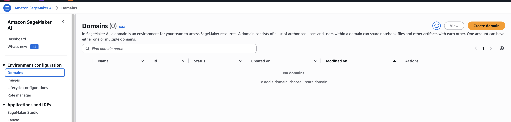
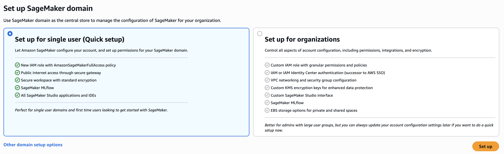
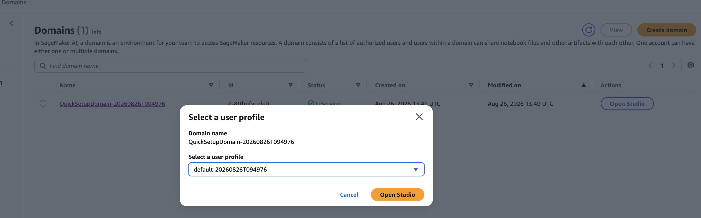
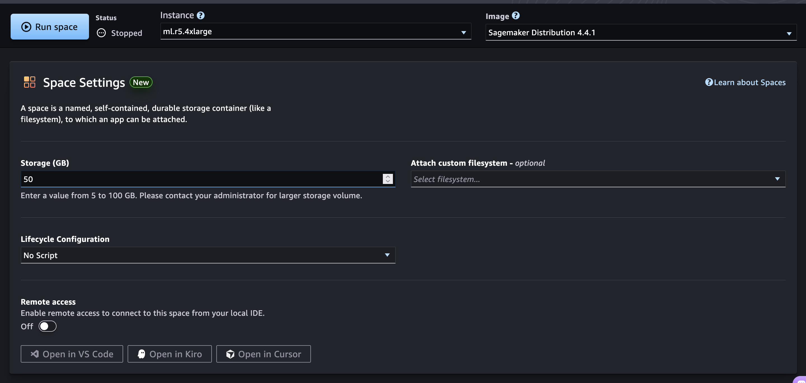
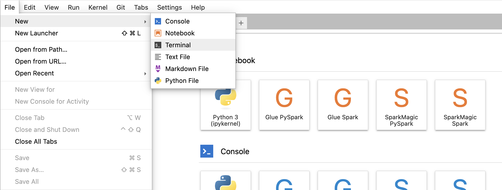
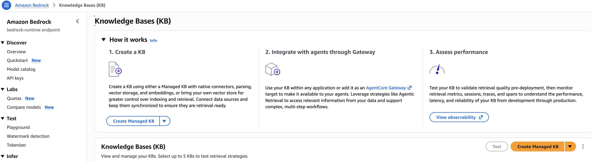
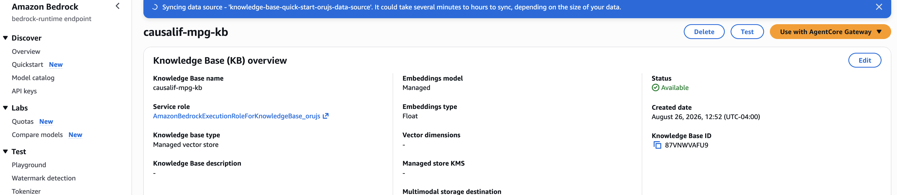
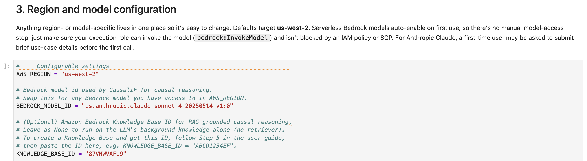

# CausalIF Auto MPG Demo — User Guide

This guide walks you through running the **CausalIF Auto MPG demo notebook**
(`causalif-mpg-demo.ipynb`) end-to-end on AWS. It answers the business question
*"What factors influence MPG in cars?"* using the [CausalIF](https://github.com/awslabs/causalif)
framework and Amazon Bedrock.

It is written for **people who are new to AWS**. Each step spells out where to
click and what to expect. If you already know AWS, skip the explanations and
follow the numbered actions.

> **The notebook sets itself up.** You do **not** create an S3 bucket, copy
> files, or build a knowledge base by hand. The notebook's **first cell**
> automatically creates a bucket in your account, downloads the reference
> documents from the public GitHub repo and uploads them to that bucket, and
> provisions a fully **managed** Amazon Bedrock knowledge base. Your job is just
> to stand up a SageMaker environment, give it permission, open the notebook,
> and run it.

> **Time and cost note:** This walkthrough spins up paid AWS resources
> (a SageMaker JupyterLab space on an `ml.r5.4xlarge` instance, a Bedrock
> managed knowledge base, and Amazon Bedrock model calls). You are billed while
> these run. Follow the **[Cleanup](#7-cleanup-stop-paying-when-youre-done)**
> section when you finish. Expect roughly **30–45 minutes**, most of it waiting
> for the SageMaker domain to create and the notebook's setup cell to build the
> knowledge base.

---

## What you'll do

1. **Set up a SageMaker AI domain** (your notebook workspace).
2. **Grant the domain permission** to use Amazon Bedrock, S3, and IAM.
3. **Create a JupyterLab space** (`ml.r5.4xlarge`, 50 GB).
4. **Import the notebook** directly from the public GitHub repo.
5. **Update the parameters** (one cell) — usually nothing to change.
6. **Run the notebook.** The first cell provisions the bucket + knowledge base;
   the rest performs the causal analysis.

```
   SageMaker AI Domain
   └── JupyterLab space (ml.r5.4xlarge, 50 GB)
        └── causalif-mpg-demo.ipynb
             │  first cell (Section 0) runs automatically:
             ├── creates S3 bucket in YOUR account
             ├── downloads docs from GitHub (raw.githubusercontent.com/awslabs/causalif)
             │     and uploads them into your bucket
             ├── creates a MANAGED Bedrock knowledge base + ingests the docs
             └── then: data → CausalIF causal discovery → results
                        (uses Amazon Bedrock Claude model)
```

---

## Prerequisites (read first)

- **An AWS account** you can sign in to, with permission to use IAM, S3,
  Amazon Bedrock, and Amazon SageMaker AI. If someone else manages your account,
  ask them to confirm you have access to these four services.
- **Amazon Bedrock model access.** You no longer enable models on a "Model
  access" page — that page is retired. Serverless foundation models are
  automatically enabled the first time they're invoked in your account. Two
  things to know: (a) for **Anthropic Claude** models, a first-time user may be
  asked to submit brief use-case details before the first call succeeds, and
  (b) your account admin can still restrict models via IAM policies or Service
  Control Policies. See
  [Appendix A: Bedrock model access](#appendix-a-bedrock-model-access) for details.
- **The reference documents are published on GitHub.** The notebook downloads
  them from the public repo at
  `https://raw.githubusercontent.com/awslabs/causalif/main/examples/analyticon/auto-mpg/knowledge-base/`.
  This is provided for you; you don't upload anything there. (Organizers: see
  [Appendix B](#appendix-b-for-the-workshop-organizer--publish-the-files) to
  publish the files first.)

> **Use a supported Region and stay in it.** AWS resources live in a Region. The
> notebook defaults to **US West (Oregon) / `us-west-2`**, which supports both
> Amazon Bedrock **managed knowledge bases** and the default Claude model. Keep
> your SageMaker domain, Bedrock model access, and the notebook's `AWS_REGION`
> all in the same Region. The Region appears in the top-right of the AWS
> console — check it before every step.
>
> **Managed knowledge bases are only in some Regions** (for example
> `us-east-1`, `us-west-2`, `eu-west-1`) and are **not** available in
> `us-west-1`. If you change Region, pick one from that supported set and update
> `AWS_REGION` **and** `BEDROCK_MODEL_ID` accordingly (Step 5).

> **A quick word on IAM roles.** A *service role* is an identity a service
> (SageMaker, Bedrock) uses to act on your behalf — for example to read your S3
> bucket or create the knowledge base. When the console offers to "Create and
> use a new service role," accept it. You do not need to understand IAM deeply
> to finish this guide.

---

## 1. Set up a SageMaker AI domain

A **SageMaker AI domain** is the workspace that hosts your notebook environment.
You create it once.

**Steps**

1. Sign in to the [AWS console](https://console.aws.amazon.com/). Confirm the
   **Region** in the top-right corner is **US West (Oregon) / us-west-2** (or
   your chosen supported Region).
2. In the search bar, type **SageMaker** and open **Amazon SageMaker AI**.
3. In the left sidebar choose **Domains**, then **Create domain**.

4. Choose **Set up for single user (Quick setup)**. This is the fastest path for
   a demo — AWS fills in sensible defaults and creates the needed role for you.

5. If prompted, allow it to **create a new execution role**. **Note the role
   name** that appears (usually contains `AmazonSageMaker-ExecutionRole`) — you
   grant it permissions in Step 2.
6. Choose **Submit** / **Create domain**.
7. Wait until the domain **Status** becomes **InService** (a few minutes; the
   page refreshes itself).

8. In the left sidebar choose **Domains**, click on QuickSetupDomain to know the execution role.


**Checkpoint:** Your domain shows **InService** and you know the name of its
**execution role**.

---

## 2. Grant the domain permission (Bedrock + S3 + IAM)

The notebook runs under the SageMaker domain's **execution role**. Because the
first cell creates a bucket, copies files, creates an IAM role, and builds a
Bedrock knowledge base, the execution role needs permission to do those things.
**Granting this now prevents the most common failures partway through the run.**

**Steps**

1. In the AWS console go to **IAM** → **Roles**.
2. Find and open the SageMaker execution role from Step 1.
3. Choose **Add permissions** → **Attach policies**.
4. Search for and select each of the following three AWS-managed policies:
   - **`AmazonBedrockFullAccess`**
   - **`AmazonS3FullAccess`**
   - **`IAMFullAccess`**
5. Choose **Add permissions**.

These three policies together grant everything the notebook needs: creating and
uploading to S3, creating the IAM role the Knowledge Base assumes, provisioning
and syncing the managed Knowledge Base, querying it, and invoking the Bedrock
model.


**Checkpoint:** The SageMaker execution role has the `CausalIFDemoSetup` inline
policy (or the three managed policies) attached.

---

## 3. Create a JupyterLab space

A **JupyterLab space** is your actual coding environment — where the notebook
opens and runs. Here you choose how much compute you get.

**Steps**

1. From **SageMaker AI** → **Domains**, open your domain and **Launch** →
   **Studio** for your user profile. SageMaker Studio opens in a new tab.
   
2. In Studio's left sidebar, choose **JupyterLab**.
3. Choose **Create JupyterLab space**.
   - **Name:** `causalif-mpg`.
   - Choose **Create space**.
4. Configure the space's resources **before** running it:
   - **Instance type:** select **`ml.r5.4xlarge`** (a memory-optimized machine;
     the causal analysis benefits from the extra RAM).
   - **Storage (EBS):** set to **50 GB** (room for packages and data).
5. Choose **Run space**. The status moves to **Starting**, then **Running** (may take upto 10 mins).
   
6. When it shows **Running**, choose **Open JupyterLab**.


> **Heads-up on cost:** the `ml.r5.4xlarge` instance is billed per hour while the
> space is **Running**, whether or not a notebook is executing. **Stop the
> space** when you take a break (see [Cleanup](#7-cleanup-stop-paying-when-youre-done)).

**Checkpoint:** JupyterLab is open, running on an `ml.r5.4xlarge` space with
50 GB storage.

---

## 4. Import the notebook

Pull the notebook straight from the public GitHub repo — no download/upload
round-trip, no AWS credentials needed.

**Option A — one command in a terminal (recommended):**

1. In JupyterLab, choose **File** → **New** → **Terminal**.

2. Run:
   ```bash
   curl -O https://raw.githubusercontent.com/awslabs/causalif/main/examples/analyticon/auto-mpg/causalif-mpg-demo.ipynb
   ```
3. In the left file browser, **double-click** `causalif-mpg-demo.ipynb` to open it.

**Option B — upload from your machine (no code):** if you already have the
`.ipynb` locally, click the **Upload Files** (up-arrow) button in JupyterLab's
file browser and select it.

**If JupyterLab asks you to pick a kernel**, choose the default **Python 3**
kernel.

**Checkpoint:** `causalif-mpg-demo.ipynb` is open in JupyterLab.

---

## 5. Create a Knowledge Base, then set the notebook parameters

The notebook runs fine on the model's **background knowledge alone** — if you're
happy with that, you can skip straight to the parameter table at the end of this
step (leave `KNOWLEDGE_BASE_ID = None`) and go to Step 6.

To ground CausalIF's reasoning in domain documents, create an Amazon Bedrock
**Knowledge Base** and paste its ID into the notebook. The steps below create an
S3 bucket, upload the reference documents into it, and build the Knowledge Base.

> **Region note:** create the bucket and the Knowledge Base in the **same
> Region** as the notebook's `AWS_REGION` (default `us-west-2`). Keep Block
> Public Access **on** — the Knowledge Base reads the bucket through its IAM
> service role, not public access.

> The `aws` CLI commands below are already authenticated as your SageMaker
> execution role — no keys to configure. Run them in a **JupyterLab terminal**
> (**File → New → Terminal**). The bucket name is derived from your AWS account
> number automatically (via `aws sts get-caller-identity`), so you can paste the
> commands as-is.

### Step 5.0 — Get the Auto MPG dataset (required)

The notebook reads the observational data from `auto-mpg.data` (the `DATA_PATH`
in Section 3). This step is required whether or not you use a Knowledge Base.

Download the Auto MPG dataset from the UCI Machine Learning Repository —
[auto+mpg.zip](https://archive.ics.uci.edu/static/public/9/auto+mpg.zip) — unzip
it, extract the `auto-mpg.data` file, and place it in the **root (home) of this
workspace**, the same folder as the notebook.

From a JupyterLab terminal, the whole thing is one paste:

```bash
curl -fsSL -o auto+mpg.zip https://archive.ics.uci.edu/static/public/9/auto+mpg.zip
unzip -o auto+mpg.zip auto-mpg.data
```

**Checkpoint:** `auto-mpg.data` sits next to `causalif-mpg-demo.ipynb`. If you're
running on background knowledge only (no Knowledge Base), you can skip the rest
of Step 5 and go to Step 6 — just leave `KNOWLEDGE_BASE_ID = None`.

### Step 5.1 — Create an S3 bucket (or reuse an existing one)

You can create the bucket from the AWS console (no commands needed) or from the
JupyterLab terminal. Pick whichever feels more comfortable.

> **Keep your Region consistent.** Create the bucket in the same Region as the
> notebook's `AWS_REGION` (default **us-west-2**) so the Knowledge Base can
> read it without cross-region complications.

#### Option A — AWS console (recommended for first-time users)

1. In the AWS console search bar type **S3** and open **Amazon S3**. Confirm the
   Region in the top-right is **US West (Oregon) / us-west-2**.
2. Choose **Create bucket**.
3. **Bucket name:** enter a globally unique name using your AWS account number
   so it won't clash with anyone else's bucket:
   ```
   causalif-analyticon2026-<your-12-digit-account-id>
   ```
   Your account ID is shown in the top-right of the console (click your name).
   Example: `causalif-analyticon2026-123456789012`.
4. **AWS Region:** confirm it is set to **US West (Oregon) us-west-2**.
5. **Block Public Access settings:** leave all four checkboxes **checked** (the
   default). The Knowledge Base accesses the bucket through an IAM service role,
   not public access.
6. Leave all other settings at their defaults and choose **Create bucket**.

Note the bucket name — you will need it in Step 5.2 and when configuring the
Knowledge Base data source in Step 5.3.

#### Option B — JupyterLab terminal (CLI)

Open a terminal in JupyterLab (**File → New → Terminal**) and run:

```bash
# Region for the bucket + Knowledge Base (match the notebook's AWS_REGION)
REGION=us-west-2

# Look up your AWS account number (no need to type it in)
ACCOUNT_ID=$(aws sts get-caller-identity --query Account --output text)

# Derive a unique bucket name from the account number.
BUCKET=causalif-analyticon2026-$ACCOUNT_ID
echo "Bucket: $BUCKET"

# Create the bucket
aws s3 mb s3://$BUCKET --region $REGION
```

The `BUCKET` variable is reused in Step 5.2, so keep this terminal session open.

To **reuse an existing bucket** instead, skip `aws s3 mb` and set:
`BUCKET=my-existing-bucket`.

### Step 5.2 — Download the reference documents from GitHub and upload to S3

Pull the demo's reference documents from the public GitHub repo, then upload them
to your bucket under a `knowledge-base/` prefix — all from the CLI, no manual
download/upload. This reuses the `$BUCKET` variable from Step 5.1:

```bash
# 1. Download the reference documents from GitHub into a local folder
mkdir -p kb-docs
BASE=https://raw.githubusercontent.com/awslabs/causalif/main/examples/analyticon/auto-mpg/knowledge-base
curl -fsSL -o kb-docs/fuel_economy_primer.md "$BASE/fuel_economy_primer.md"
curl -fsSL -o kb-docs/epa_trends_report.pdf "$BASE/epa_trends_report.pdf"

# 2. Upload them to your bucket under the knowledge-base/ prefix
aws s3 cp kb-docs/ s3://$BUCKET/knowledge-base/ --recursive

# 3. (Optional) confirm the upload
aws s3 ls s3://$BUCKET/knowledge-base/
```

You can also add your own domain documents (PDF, TXT, Markdown, HTML, CSV, Word)
to the same prefix — for this MPG example, useful docs describe how engine size,
weight, and horsepower affect fuel economy.

> _[Screenshot placeholder: S3 bucket showing the knowledge-base/ prefix with the uploaded files]_

### Step 5.3 — Create the Knowledge Base in the console

1. Open the **Amazon Bedrock console** → left nav → under **Build**,
   choose **Knowledge Bases** → **Create Managed KB**.
   
2. **Name** the KB (e.g. `causalif-mpg-kb`).
3. **IAM permissions:** let the console **create and use a new service role**.
4. **Data source:** choose **Amazon S3** and set the S3 URI to your uploaded
   prefix: `s3://<your-bucket>/knowledge-base/`. If you need the exact name, run
   `echo s3://$BUCKET/knowledge-base/` in the terminal from Step 5.1, or use
   **Browse S3** to pick the `causalif-analyticon2026-<account-id>` bucket.
5. Review and choose **Create Knowledge Base**. Provisioning takes a few minutes;
   wait for the status to become **Available** and Sync completed.

6.On the Knowledge Base overview page, copy the **Knowledge Base ID** (a short
string like `ABCD1234EF`).

### Step 5.6 — Set the notebook parameters

Open the notebook and edit the **Section 3 configuration cell**
(`# --- Configurable settings ---`):

| Parameter | What to set it to |
|---|---|
| `AWS_REGION` | Your Region. Default `"us-west-2"`. Must match where you created the bucket/KB and where `BEDROCK_MODEL_ID` is available. |
| `BEDROCK_MODEL_ID` | A **current** Claude model ID for your Region. Default `"us.anthropic.claude-sonnet-4-5-20250929-v1:0"` (US Claude Sonnet 4.5). For EU use the matching `eu.` profile. Avoid older/Legacy models (see Troubleshooting). |
| `KNOWLEDGE_BASE_ID` | Paste the Knowledge Base ID you copied in Step 5.3, e.g. `"ABCD1234EF"`. **Leave it as `None` to skip the KB** and run on background knowledge alone. |

When `KNOWLEDGE_BASE_ID` is set, the notebook's Section 5 cell builds a retriever
and Section 6 passes it to CausalIF. When it's `None`, the retriever is skipped
automatically — no other edits needed.



**Checkpoint:** Either `KNOWLEDGE_BASE_ID = None` (background-knowledge run), or
it holds your synced Knowledge Base's ID, and `AWS_REGION` / `BEDROCK_MODEL_ID`
match your environment.

---

## 6. Run the notebook

Run the cells **top to bottom, in order**. Each section produces output the next
one depends on.

**Steps**

1. From the menu, choose **Run** → **Run All Cells**, **or** click into the
   first cell and press **Shift + Enter** repeatedly to step through (recommended
   your first time, so you can watch each stage).
2. Watch these milestones (the notebook's numbered sections):
   - **1–2. Install & import** — installs `causalif` and `langchain-aws` with
     `%pip`, then imports them.
     > **You may need to restart the kernel once** after the first install so the
     > new packages are importable: **Kernel** → **Restart Kernel**, then run
     > from the top again.
   - **3. Region and model configuration** — prints the Region, model, and
     `Knowledge Base ID` (or `(none - using background knowledge only)`).
   - **4. Prepare the data** — reads `auto-mpg.data`, cleans it, and prints the
     analysis factors and row count.
   - **5. Retriever** — if `KNOWLEDGE_BASE_ID` is set, prints that the retriever
     was created; otherwise prints that it's skipped.
   - **6. Configure the engine** — calls `set_causalif_engine` (passing the
     retriever, or `None`) and prints a confirmation.
   - **7. Run the causal analysis** — runs `causalif("what influences mpg")`.
     This makes several Bedrock calls per factor pair, so it takes a little while.
   - **8. Visualise** — renders the interactive Plotly causal graph.
   - **9. Save** — writes `result.json` next to the notebook.
3. Read the analysis **summary** printed by Section 7 and the causal graph from
   Section 8 — together they answer *"What factors influence MPG in cars?"*.

> _[Screenshot placeholder: The rendered causal graph output]_

**Checkpoint:** The notebook ran to the end and produced the causal graph and
`result.json`.

---

## 7. Cleanup (stop paying when you're done)

Do these when you finish so you stop incurring charges:

1. **Stop the JupyterLab space** (biggest ongoing cost): SageMaker Studio →
   **JupyterLab** → your `causalif-mpg` space → **Stop space**. Stopping keeps
   your files but stops the hourly instance charge. **Delete** the space to
   remove it entirely.
2. **Delete the managed knowledge base** if you no longer need it: Amazon Bedrock
   → **Knowledge Bases** → select `causalif-auto-mpg-kb` → **Delete**. Because it
   is a managed knowledge base, deleting it also removes the vector store Bedrock
   created for it.
3. **Delete the S3 bucket** the setup created (optional): S3 → the
   `causalif-analyticon2026-<uuid>` bucket → empty it, then delete it.
4. **Delete the IAM role** the setup created (optional): IAM → **Roles** →
   `CausalIFAutoMpgKBRole` → delete.
5. **Delete the SageMaker domain** (optional): SageMaker AI → **Domains** →
   delete if you won't reuse it (delete spaces/apps first).
6. **Bedrock models** carry no standing charge (you pay per call) and require no
   teardown — there's nothing to "disable."

> _[Screenshot placeholder: JupyterLab space with the Stop space button]_

---

## 8. Troubleshooting

| Symptom | Likely cause | Fix |
|---|---|---|
| Section 0 fails creating the bucket / role | Execution role missing S3 or IAM permission | Attach the policies in Step 2. |
| Section 0 fails creating the knowledge base | Region doesn't support managed KBs, or missing Bedrock permission | Use a supported Region (e.g. `us-west-2`); confirm `AmazonBedrockFullAccess` (or the scoped Bedrock actions). |
| "Failed to download reference document from https://raw.githubusercontent.com/..." | Files not pushed/public, or wrong URL | Confirm `GITHUB_RAW_BASE`/`KB_DOC_FILES`; open a raw URL in a browser to verify the files are published (Appendix B). |
| `AccessDenied` / "You don't have access to the model" in Section 5 | First-time Anthropic use-case form not submitted, IAM/SCP restriction, or wrong Region | Models auto-enable on first use, but Anthropic may require a one-time use-case submission — complete it in **Bedrock → Model catalog** (Appendix A). Confirm no IAM/SCP blocks the model and that `AWS_REGION` / `BEDROCK_MODEL_ID` match. |
| `ResourceNotFoundException ... Converse operation: Access denied. This Model is marked by provider as Legacy ...` during the analysis (Section 7) | `BEDROCK_MODEL_ID` points at a model the provider has retired (Legacy); access is cut off after 30 days of inactivity. The notebook may truncate the message at "...Access denied. Th", making it look like a permissions error | Set `BEDROCK_MODEL_ID` to a **current** model. In **us-west-2**, `us.anthropic.claude-sonnet-4-5-20250929-v1:0` (Sonnet 4.5) works; find current IDs in **Bedrock → Model catalog**. This is not an IAM problem — no policy change needed. |
| Retriever cell errors on `Retrieve` | KB id wrong, or `bedrock:Retrieve` not permitted | Re-run Section 0 to reset `KNOWLEDGE_BASE_ID`; confirm the `bedrock:Retrieve` permission (in the Step 2 policy). |
| "Unable to locate credentials" / token expired | Not running under the SageMaker role, or session expired | Ensure you're inside the SageMaker JupyterLab space; restart the kernel. |
| Import errors after install | Kernel started before packages installed | **Kernel → Restart Kernel**, then run all cells again. |
| Empty causal graph | Bedrock throttling emptied the graph | Re-run; the notebook already keeps concurrency low (`max_parallel_queries=2`). |

---

## 9. FAQ for first-time AWS users

- **What is a Region?** A geographic location where your AWS resources run. Keep
  everything in this demo in the same supported Region.
- **What is an S3 bucket?** Cloud file storage. The notebook creates one and
  uploads the reference documents (downloaded from GitHub) into it automatically.
- **What is a knowledge base?** A searchable index built from your documents so
  the AI model can look things up instead of guessing. This demo uses a
  *managed* knowledge base — Bedrock runs the storage and indexing for you.
- **What is SageMaker Studio / JupyterLab?** A hosted coding environment in the
  browser where the notebook runs on AWS machines.
- **What is an execution role?** The identity SageMaker uses to access other AWS
  services (Bedrock, S3, IAM) on your behalf. You granted it permissions in
  Step 2.
- **Do I need AWS access keys?** No. Inside SageMaker, the notebook uses the
  execution role automatically. Never paste access keys into the notebook.

---

## Appendix A: Bedrock model access

**You no longer manually enable model access.** Amazon has retired the "Model
access" page. Serverless foundation models are automatically enabled across AWS
commercial Regions the first time they are invoked in your account, so the
notebook can call the model without any pre-activation step.

A few things to be aware of:

- **Anthropic Claude first-time use.** For Anthropic models, a first-time user
  may be prompted to submit brief **use-case details** before the first
  invocation is allowed. If your very first run fails with an access/eligibility
  message mentioning use-case submission, complete that one-time form in the
  Bedrock console (**Model catalog** → open the Claude model), then re-run.
- **Admin restrictions still apply.** Account administrators can restrict which
  models are usable through **IAM policies** and **Service Control Policies
  (SCPs)**. If a call is denied, confirm with your admin that the Claude model in
  your Region isn't blocked by policy. (The execution role also needs
  `bedrock:InvokeModel` — covered by `AmazonBedrockFullAccess` in Step 2.)
- **AWS Marketplace models** (not used by this demo's default) require a user
  with Marketplace permissions to invoke the model once to enable it
  account-wide.

**Confirming the exact model ID for your Region.** The notebook default is the US
Claude Sonnet 4.5 profile for **us-west-2**
(`us.anthropic.claude-sonnet-4-5-20250929-v1:0`). Use a **current** model —
retired/Legacy models fail with `ResourceNotFoundException ... marked by provider
as Legacy`. To use a different Region or a newer model, open **Amazon Bedrock** →
**Model catalog**, open the Claude model, and copy its exact **model ID** into
`BEDROCK_MODEL_ID` (Step 5). Regions use different prefixes (`us.` for the US,
`eu.` for Europe), so copy the ID for *your* Region.

> _[Screenshot placeholder: Bedrock → Model catalog → Claude model detail showing the model ID]_

---

## Appendix B: For the workshop organizer — publish the files

*Skip this if you're an attendee. This is for whoever prepares the demo.*

The notebook (imported in Step 4) and the reference documents (downloaded by the
Section 0 setup cell) are both served from the **public GitHub repo**. Publish
them once so every attendee can pull from raw URLs — no S3 bucket to stage and no
public-bucket setup.

1. Commit and push these files to the public repo on the `main` branch so they
   resolve at the expected paths:
   ```
   examples/analyticon/auto-mpg/causalif-mpg-demo.ipynb
   examples/analyticon/auto-mpg/knowledge-base/fuel_economy_primer.md
   examples/analyticon/auto-mpg/knowledge-base/epa_trends_report.pdf
   ```
2. Verify each raw URL returns the file (HTTP 200), for example:
   ```bash
   curl -I https://raw.githubusercontent.com/awslabs/causalif/main/examples/analyticon/auto-mpg/causalif-mpg-demo.ipynb
   curl -I https://raw.githubusercontent.com/awslabs/causalif/main/examples/analyticon/auto-mpg/knowledge-base/fuel_economy_primer.md
   curl -I https://raw.githubusercontent.com/awslabs/causalif/main/examples/analyticon/auto-mpg/knowledge-base/epa_trends_report.pdf
   ```
3. If you publish to a **different repo, branch, or path**, update the notebook's
   Config_Cell before distributing:
   - `GITHUB_RAW_BASE` — the raw base URL of the `knowledge-base` folder.
   - `KB_DOC_FILES` — the list of document filenames to fetch.
   - and update the Step 4 `curl` URL in this guide to match.

The attendee notebooks only **read** from GitHub; each attendee's own private S3
bucket (created by the setup cell) holds the uploaded copies that the managed
knowledge base ingests.

> _[Screenshot placeholder: GitHub repo showing examples/analyticon/auto-mpg/ with the notebook and knowledge-base/ folder]_
