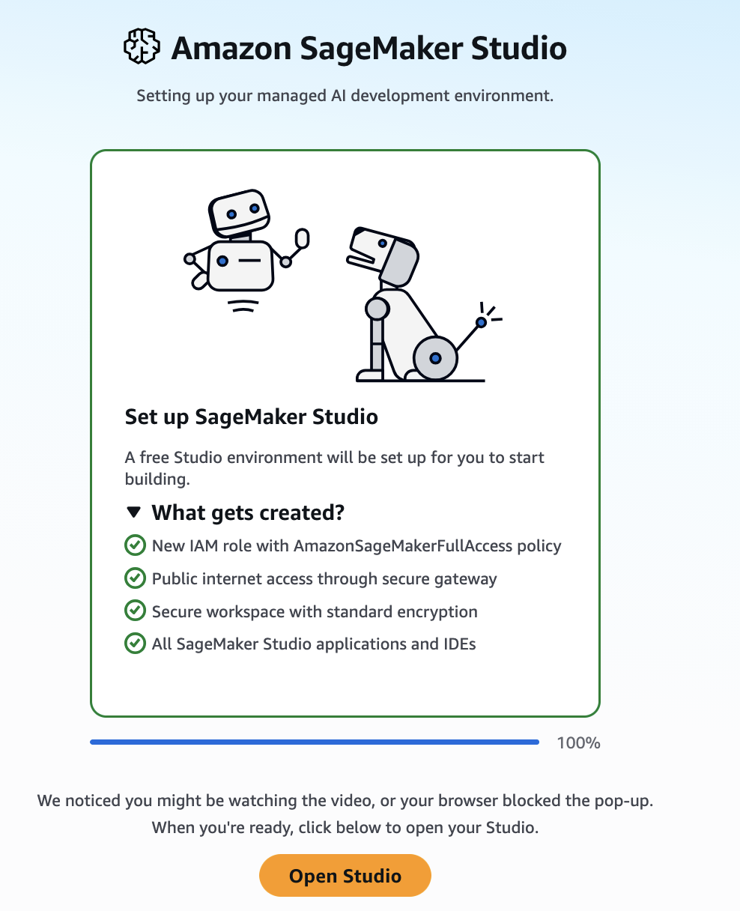
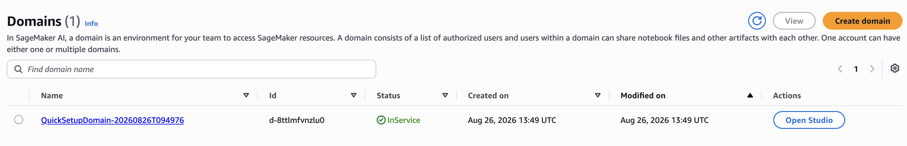
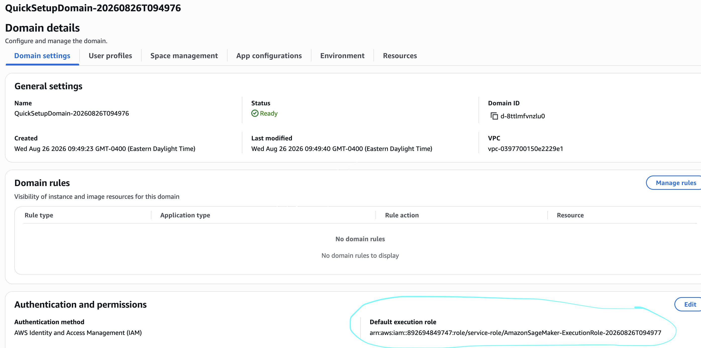
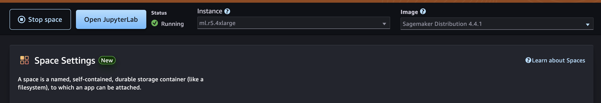

# CausalIF Auto MPG Demo — User Guide

This guide walks you through running the **CausalIF Auto MPG demo notebook**
(`causalif-mpg-demo.ipynb`) end-to-end on AWS. It answers the business question
*"What factors influence MPG in cars?"* using the [CausalIF](https://github.com/awslabs/causalif)
framework and Amazon Bedrock.

It is written for **people who are new to AWS**. Each step spells out where to
click and what to expect. If you already know AWS, skip the explanations and
follow the numbered actions.

> **The notebook sets itself up.** You do **not** create an S3 bucket, copy
> files, or build a knowledge base by hand. The notebook's **first cell**
> automatically creates a bucket in your account, downloads the reference
> documents from the public GitHub repo and uploads them to that bucket, and
> provisions a fully **managed** Amazon Bedrock knowledge base. Your job is just
> to stand up a SageMaker environment, give it permission, open the notebook,
> and run it.

> **Time and cost note:** This walkthrough spins up paid AWS resources
> (a SageMaker JupyterLab space on an `ml.r5.4xlarge` instance, a Bedrock
> managed knowledge base, and Amazon Bedrock model calls). You are billed while
> these run. Follow the **[Cleanup](#7-cleanup-stop-paying-when-youre-done)**
> section when you finish. Expect roughly **30–45 minutes**, most of it waiting
> for the SageMaker domain to create and the notebook's setup cell to build the
> knowledge base.

---

## What you'll do

1. **Set up a SageMaker AI domain** (your notebook workspace).
2. **Grant the domain permission** to use Amazon Bedrock, S3, and IAM.
3. **Create a JupyterLab space** (`ml.r5.4xlarge`, 50 GB).
4. **Import the notebook** directly from the public GitHub repo.
5. **Update the parameters** (one cell) — usually nothing to change.
6. **Run the notebook.** The first cell provisions the bucket + knowledge base;
   the rest performs the causal analysis.

```
   SageMaker AI Domain
   └── JupyterLab space (ml.r5.4xlarge, 50 GB)
        └── causalif-mpg-demo.ipynb
             │  first cell (Section 0) runs automatically:
             ├── creates S3 bucket in YOUR account
             ├── downloads docs from GitHub (raw.githubusercontent.com/awslabs/causalif)
             │     and uploads them into your bucket
             ├── creates a MANAGED Bedrock knowledge base + ingests the docs
             └── then: data → CausalIF causal discovery → results
                        (uses Amazon Bedrock Claude model)
```

---

## Prerequisites (read first)

- **An AWS account** you can sign in to, with permission to use IAM, S3,
  Amazon Bedrock, and Amazon SageMaker AI. If someone else manages your account,
  ask them to confirm you have access to these four services.
- **Amazon Bedrock model access.** You no longer enable models on a "Model
  access" page — that page is retired. Serverless foundation models are
  automatically enabled the first time they're invoked in your account. Two
  things to know: (a) for **Anthropic Claude** models, a first-time user may be
  asked to submit brief use-case details before the first call succeeds, and
  (b) your account admin can still restrict models via IAM policies or Service
  Control Policies. See
  [Appendix A: Bedrock model access](#appendix-a-bedrock-model-access) for details.
- **The reference documents are published on GitHub.** The notebook downloads
  them from the public repo at
  `https://raw.githubusercontent.com/awslabs/causalif/main/examples/auto-mpg/knowledge-base/`.
  This is provided for you; you don't upload anything there. (Organizers: see
  [Appendix B](#appendix-b-for-the-workshop-organizer--publish-the-files) to
  publish the files first.)

> **Use a supported Region and stay in it.** AWS resources live in a Region. The
> notebook defaults to **US West (Oregon) / `us-west-2`**, which supports both
> Amazon Bedrock **managed knowledge bases** and the default Claude model. Keep
> your SageMaker domain, Bedrock model access, and the notebook's `AWS_REGION`
> all in the same Region. The Region appears in the top-right of the AWS
> console — check it before every step.
>
> **Managed knowledge bases are only in some Regions** (for example
> `us-east-1`, `us-west-2`, `eu-west-1`) and are **not** available in
> `us-west-1`. If you change Region, pick one from that supported set and update
> `AWS_REGION` **and** `BEDROCK_MODEL_ID` accordingly (Step 5).

> **A quick word on IAM roles.** A *service role* is an identity a service
> (SageMaker, Bedrock) uses to act on your behalf — for example to read your S3
> bucket or create the knowledge base. When the console offers to "Create and
> use a new service role," accept it. You do not need to understand IAM deeply
> to finish this guide.

---

## 1. Set up a SageMaker AI domain

A **SageMaker AI domain** is the workspace that hosts your notebook environment.
You create it once.

**Steps**

1. Sign in to the [AWS console](https://console.aws.amazon.com/). Confirm the
   **Region** in the top-right corner is **US West (Oregon) / us-west-2** (or
   your chosen supported Region).
2. In the search bar, type **SageMaker** and open **Amazon SageMaker AI**.
3. In the left sidebar choose **Domains**, then **Create domain**.

4. Choose **Set up for single user (Quick setup)**. This is the fastest path for
   a demo — AWS fills in sensible defaults and creates the needed role for you.

5. If prompted, allow it to **create a new execution role**. **Note the role
   name** that appears (usually contains `AmazonSageMaker-ExecutionRole`) — you
   grant it permissions in Step 2.
6. Choose **Submit** / **Create domain**.
7. Wait until the domain **Status** becomes **InService** (a few minutes; the
   page refreshes itself).

8. In the left sidebar choose **Domains**, click on QuickSetupDomain to know the execution role.




**Checkpoint:** Your domain shows **InService** and you know the name of its
**execution role**.

---

## 2. Grant the domain permission (Bedrock + S3 + IAM)

The notebook runs under the SageMaker domain's **execution role**. Because the
first cell creates a bucket, copies files, creates an IAM role, and builds a
Bedrock knowledge base, the execution role needs permission to do those things.
**Granting this now prevents the most common failures partway through the run.**

**Steps**

1. In the AWS console go to **IAM** → **Roles**.
2. Find and open the SageMaker execution role from Step 1.
3. Choose **Add permissions** → **Create inline policy**.
4. Choose the **JSON** tab. **Delete** whatever is in the editor and **paste**
   the policy below in its place.
5. Choose **Next**, give the policy a name (for example `CausalIFDemoSetup`), and
   choose **Create policy**.

This single inline policy grants everything the setup cell needs — creating the
S3 bucket and uploading the documents, creating the small IAM role the knowledge
base assumes, provisioning and syncing the managed knowledge base, querying it,
and invoking the Bedrock model:

```json
{
  "Version": "2012-10-17",
  "Statement": [
    {
      "Sid": "S3BucketAndDocs",
      "Effect": "Allow",
      "Action": [
        "s3:CreateBucket",
        "s3:PutObject",
        "s3:GetObject",
        "s3:ListBucket",
        "s3:GetBucketLocation"
      ],
      "Resource": [
        "arn:aws:s3:::causalif-analyticon2026-*",
        "arn:aws:s3:::causalif-analyticon2026-*/*"
      ]
    },
    {
      "Sid": "CreateKBServiceRole",
      "Effect": "Allow",
      "Action": [
        "iam:CreateRole",
        "iam:GetRole",
        "iam:PutRolePolicy"
      ],
      "Resource": "arn:aws:iam::*:role/CausalIFAutoMpgKBRole"
    },
    {
      "Sid": "PassKBRoleToBedrock",
      "Effect": "Allow",
      "Action": "iam:PassRole",
      "Resource": "arn:aws:iam::*:role/CausalIFAutoMpgKBRole",
      "Condition": {
        "StringEquals": { "iam:PassedToService": "bedrock.amazonaws.com" }
      }
    },
    {
      "Sid": "ManagedKnowledgeBase",
      "Effect": "Allow",
      "Action": [
        "bedrock:CreateKnowledgeBase",
        "bedrock:GetKnowledgeBase",
        "bedrock:ListKnowledgeBases",
        "bedrock:CreateDataSource",
        "bedrock:GetDataSource",
        "bedrock:ListDataSources",
        "bedrock:StartIngestionJob",
        "bedrock:GetIngestionJob",
        "bedrock:ListIngestionJobs"
      ],
      "Resource": "*"
    },
    {
      "Sid": "RetrieveAndInvokeModel",
      "Effect": "Allow",
      "Action": [
        "bedrock:Retrieve",
        "bedrock:InvokeModel",
        "bedrock:Rerank"
      ],
      "Resource": "*"
    }
  ]
}
```

Notes on the policy:

- The S3 statement is scoped to bucket names starting with
  `causalif-analyticon2026-` (the auto-generated name in the notebook). **If you
  set a custom `TARGET_BUCKET`, change both `Resource` ARNs** to match your
  bucket name.
- The IAM statements are scoped to the single role name `CausalIFAutoMpgKBRole`
  (the notebook's `KB_ROLE_NAME`). If you change `KB_ROLE_NAME`, update these
  ARNs too.
- `bedrock:Retrieve` is the action that authorizes the knowledge-base query the
  retriever tool makes at runtime.

**Simpler (broader) alternative for a throwaway demo account:** instead of the
inline policy, choose **Add permissions → Attach policies** and attach the
AWS-managed **`AmazonBedrockFullAccess`**, **`AmazonS3FullAccess`**, and
**`IAMFullAccess`**. This is easier but much broader — prefer the scoped inline
policy above, especially in a shared or production account.


**Checkpoint:** The SageMaker execution role has the `CausalIFDemoSetup` inline
policy (or the three managed policies) attached.

---

## 3. Create a JupyterLab space

A **JupyterLab space** is your actual coding environment — where the notebook
opens and runs. Here you choose how much compute you get.

**Steps**

1. From **SageMaker AI** → **Domains**, open your domain and **Launch** →
   **Studio** for your user profile. SageMaker Studio opens in a new tab.
   
2. In Studio's left sidebar, choose **JupyterLab**.
3. Choose **Create JupyterLab space**.
   - **Name:** `causalif-mpg`.
   - Choose **Create space**.
4. Configure the space's resources **before** running it:
   - **Instance type:** select **`ml.r5.4xlarge`** (a memory-optimized machine;
     the causal analysis benefits from the extra RAM).
   - **Storage (EBS):** set to **50 GB** (room for packages and data).
5. Choose **Run space**. The status moves to **Starting**, then **Running** (may take upto 10 mins).
   
6. When it shows **Running**, choose **Open JupyterLab**.


> **Heads-up on cost:** the `ml.r5.4xlarge` instance is billed per hour while the
> space is **Running**, whether or not a notebook is executing. **Stop the
> space** when you take a break (see [Cleanup](#7-cleanup-stop-paying-when-youre-done)).

**Checkpoint:** JupyterLab is open, running on an `ml.r5.4xlarge` space with
50 GB storage.

---

## 4. Import the notebook

Pull the notebook straight from the public GitHub repo — no download/upload
round-trip, no AWS credentials needed.

**Option A — one command in a terminal (recommended):**

1. In JupyterLab, choose **File** → **New** → **Terminal**.

2. Run:
   ```bash
   curl -O https://raw.githubusercontent.com/awslabs/causalif/main/examples/auto-mpg/causalif-mpg-demo.ipynb
   ```
3. In the left file browser, **double-click** `causalif-mpg-demo.ipynb` to open it.

**Option B — upload from your machine (no code):** if you already have the
`.ipynb` locally, click the **Upload Files** (up-arrow) button in JupyterLab's
file browser and select it.

**If JupyterLab asks you to pick a kernel**, choose the default **Python 3**
kernel.

**Checkpoint:** `causalif-mpg-demo.ipynb` is open in JupyterLab.

---

## 5. Update the parameters

The notebook is designed so you edit **exactly one cell** — the
**Configuration** cell (section 2, commented `# Config_Cell`). For a default run
in `us-west-2`, **you usually don't need to change anything.**

**When you DO need to edit it:**

| Situation | What to change |
|---|---|
| Running in a Region other than `us-west-2` | Set `AWS_REGION` to your supported Region (e.g. `"us-east-1"`, `"eu-west-1"`) **and** set `BEDROCK_MODEL_ID` to the matching Claude profile for that Region (e.g. `us.` prefix for US, `eu.` for EU). |
| You already have a knowledge base | Paste its id into `KNOWLEDGE_BASE_ID` — the setup cell then skips provisioning. |
| You want to skip the knowledge base entirely | Set `RUN_BOOTSTRAP = False` and leave `KNOWLEDGE_BASE_ID = ""`. The notebook runs on the model's background knowledge alone. |
| You want a specific bucket name | Set `TARGET_BUCKET` to a name you own. Leave it `None` to auto-generate a unique name of the form `causalif-analyticon2026-<uuid>`. |

For reference, the automated-setup knobs in the same cell are:

- `RUN_BOOTSTRAP` — whether the first cell provisions the bucket + knowledge base (default `True`).
- `GITHUB_RAW_BASE` / `KB_DOC_FILES` — the public GitHub raw base URL and the list of reference-document filenames the docs are downloaded **from**.
- `TARGET_BUCKET` / `TARGET_KB_PREFIX` — where the docs are uploaded **to** in your account.
- `KB_NAME` / `KB_ROLE_NAME` — names for the managed knowledge base and its IAM role.
- `KB_NUM_RESULTS` — passages the retriever returns per query.

> **Region, model, and knowledge base must agree.** `AWS_REGION` has to be a
> Region that supports managed knowledge bases **and** where you enabled
> `BEDROCK_MODEL_ID`. A mismatch is the usual cause of "access denied", "model
> not available", or knowledge-base-creation errors.

> _[Screenshot placeholder: The Config_Cell showing AWS_REGION, BEDROCK_MODEL_ID, and RUN_BOOTSTRAP]_

**Checkpoint:** The Config_Cell matches your Region and model (defaults are fine
for `us-west-2`).

---

## 6. Run the notebook

Run the cells **top to bottom, in order**. Each section produces output the next
one depends on.

**Steps**

1. From the menu, choose **Run** → **Run All Cells**, **or** click into the
   first cell and press **Shift + Enter** repeatedly to step through (recommended
   your first time, so you can watch each stage).
2. Watch these milestones:
   - **1. Setup** — installs the pinned packages, then imports them. The install
     log ends with `Successfully installed ...`.
     > **You may need to restart the kernel once** after the first install so the
     > new packages are importable: **Kernel** → **Restart Kernel**, then run
     > from the top again.
   - **Automated setup (Section 0)** — prints numbered progress: `[1/6]` create
     bucket, `[2/6]` copy documents, `[3/6]` create IAM role, `[4/6]` create the
     managed knowledge base, `[5/6]` add the data source, `[6/6]` ingest and
     wait, ending with **"Automated setup complete. KNOWLEDGE_BASE_ID = ..."**.
     This is the longest step (a few minutes) because it builds and populates the
     knowledge base. It is safe to re-run — it reuses whatever already exists.
   - **Retriever tool** — prints a line confirming the retriever tool was created
     for your knowledge base id.
   - **3. Data acquisition** — downloads the UCI Auto MPG dataset and prints its
     shape (~398 rows) and the first 5 rows.
   - **4. Data preparation** — prints how many records were retained (~392).
   - **5. Causal analysis** — configures the engine (prints a confirmation naming
     your Region and model), then runs discovery. This calls Bedrock and takes a
     little time.
   - **6. Results presentation** — renders the causal graph, prints an edge
     table, a written summary with an `Answer:` line, and (if enabled) an
     interventional "what-if" result.
3. Read the **`Answer:`** line and the **Conclusion** section at the bottom —
   that's the response to *"What factors influence MPG in cars?"* for this run.
4. The notebook also saves an interactive graph (default
   `causalif-mpg-graph.html`) next to the notebook. Double-click it in the file
   browser, or right-click → **Download** to view locally.

> _[Screenshot placeholder: Section 0 automated-setup output showing steps [1/6]..[6/6] complete]_
>
> _[Screenshot placeholder: The rendered causal graph output]_
>
> _[Screenshot placeholder: The edge table and the Answer: line]_

**Checkpoint:** The notebook ran to the end and the final Conclusion answers the
business question.

---

## 7. Cleanup (stop paying when you're done)

Do these when you finish so you stop incurring charges:

1. **Stop the JupyterLab space** (biggest ongoing cost): SageMaker Studio →
   **JupyterLab** → your `causalif-mpg` space → **Stop space**. Stopping keeps
   your files but stops the hourly instance charge. **Delete** the space to
   remove it entirely.
2. **Delete the managed knowledge base** if you no longer need it: Amazon Bedrock
   → **Knowledge Bases** → select `causalif-auto-mpg-kb` → **Delete**. Because it
   is a managed knowledge base, deleting it also removes the vector store Bedrock
   created for it.
3. **Delete the S3 bucket** the setup created (optional): S3 → the
   `causalif-analyticon2026-<uuid>` bucket → empty it, then delete it.
4. **Delete the IAM role** the setup created (optional): IAM → **Roles** →
   `CausalIFAutoMpgKBRole` → delete.
5. **Delete the SageMaker domain** (optional): SageMaker AI → **Domains** →
   delete if you won't reuse it (delete spaces/apps first).
6. **Bedrock models** carry no standing charge (you pay per call) and require no
   teardown — there's nothing to "disable."

> _[Screenshot placeholder: JupyterLab space with the Stop space button]_

---

## 8. Troubleshooting

| Symptom | Likely cause | Fix |
|---|---|---|
| Section 0 fails creating the bucket / role | Execution role missing S3 or IAM permission | Attach the policies in Step 2. |
| Section 0 fails creating the knowledge base | Region doesn't support managed KBs, or missing Bedrock permission | Use a supported Region (e.g. `us-west-2`); confirm `AmazonBedrockFullAccess` (or the scoped Bedrock actions). |
| "Failed to download reference document from https://raw.githubusercontent.com/..." | Files not pushed/public, or wrong URL | Confirm `GITHUB_RAW_BASE`/`KB_DOC_FILES`; open a raw URL in a browser to verify the files are published (Appendix B). |
| `AccessDenied` / "You don't have access to the model" in Section 5 | First-time Anthropic use-case form not submitted, IAM/SCP restriction, or wrong Region | Models auto-enable on first use, but Anthropic may require a one-time use-case submission — complete it in **Bedrock → Model catalog** (Appendix A). Confirm no IAM/SCP blocks the model and that `AWS_REGION` / `BEDROCK_MODEL_ID` match. |
| Retriever cell errors on `Retrieve` | KB id wrong, or `bedrock:Retrieve` not permitted | Re-run Section 0 to reset `KNOWLEDGE_BASE_ID`; confirm the `bedrock:Retrieve` permission (in the Step 2 policy). |
| "Unable to locate credentials" / token expired | Not running under the SageMaker role, or session expired | Ensure you're inside the SageMaker JupyterLab space; restart the kernel. |
| Import errors after install | Kernel started before packages installed | **Kernel → Restart Kernel**, then run all cells again. |
| Empty causal graph | Bedrock throttling emptied the graph | Re-run; the notebook already keeps concurrency low (`max_parallel_queries=2`). |

---

## 9. FAQ for first-time AWS users

- **What is a Region?** A geographic location where your AWS resources run. Keep
  everything in this demo in the same supported Region.
- **What is an S3 bucket?** Cloud file storage. The notebook creates one and
  uploads the reference documents (downloaded from GitHub) into it automatically.
- **What is a knowledge base?** A searchable index built from your documents so
  the AI model can look things up instead of guessing. This demo uses a
  *managed* knowledge base — Bedrock runs the storage and indexing for you.
- **What is SageMaker Studio / JupyterLab?** A hosted coding environment in the
  browser where the notebook runs on AWS machines.
- **What is an execution role?** The identity SageMaker uses to access other AWS
  services (Bedrock, S3, IAM) on your behalf. You granted it permissions in
  Step 2.
- **Do I need AWS access keys?** No. Inside SageMaker, the notebook uses the
  execution role automatically. Never paste access keys into the notebook.

---

## Appendix A: Bedrock model access

**You no longer manually enable model access.** Amazon has retired the "Model
access" page. Serverless foundation models are automatically enabled across AWS
commercial Regions the first time they are invoked in your account, so the
notebook can call the model without any pre-activation step.

A few things to be aware of:

- **Anthropic Claude first-time use.** For Anthropic models, a first-time user
  may be prompted to submit brief **use-case details** before the first
  invocation is allowed. If your very first run fails with an access/eligibility
  message mentioning use-case submission, complete that one-time form in the
  Bedrock console (**Model catalog** → open the Claude model), then re-run.
- **Admin restrictions still apply.** Account administrators can restrict which
  models are usable through **IAM policies** and **Service Control Policies
  (SCPs)**. If a call is denied, confirm with your admin that the Claude model in
  your Region isn't blocked by policy. (The execution role also needs
  `bedrock:InvokeModel` — covered by `AmazonBedrockFullAccess` in Step 2.)
- **AWS Marketplace models** (not used by this demo's default) require a user
  with Marketplace permissions to invoke the model once to enable it
  account-wide.

**Confirming the exact model ID for your Region.** The notebook default is the US
Claude Sonnet profile for **us-west-2**
(`us.anthropic.claude-sonnet-4-20250514-v1:0`). To use a different Region, open
**Amazon Bedrock** → **Model catalog**, open the Claude model, and copy its exact
**model ID** into `BEDROCK_MODEL_ID` (Step 5). Regions use different prefixes
(`us.` for the US, `eu.` for Europe), so copy the ID for *your* Region.

> _[Screenshot placeholder: Bedrock → Model catalog → Claude model detail showing the model ID]_

---

## Appendix B: For the workshop organizer — publish the files

*Skip this if you're an attendee. This is for whoever prepares the demo.*

The notebook (imported in Step 4) and the reference documents (downloaded by the
Section 0 setup cell) are both served from the **public GitHub repo**. Publish
them once so every attendee can pull from raw URLs — no S3 bucket to stage and no
public-bucket setup.

1. Commit and push these files to the public repo on the `main` branch so they
   resolve at the expected paths:
   ```
   examples/auto-mpg/causalif-mpg-demo.ipynb
   examples/auto-mpg/knowledge-base/fuel_economy_primer.md
   examples/auto-mpg/knowledge-base/epa_trends_report.pdf
   ```
2. Verify each raw URL returns the file (HTTP 200), for example:
   ```bash
   curl -I https://raw.githubusercontent.com/awslabs/causalif/main/examples/auto-mpg/causalif-mpg-demo.ipynb
   curl -I https://raw.githubusercontent.com/awslabs/causalif/main/examples/auto-mpg/knowledge-base/fuel_economy_primer.md
   curl -I https://raw.githubusercontent.com/awslabs/causalif/main/examples/auto-mpg/knowledge-base/epa_trends_report.pdf
   ```
3. If you publish to a **different repo, branch, or path**, update the notebook's
   Config_Cell before distributing:
   - `GITHUB_RAW_BASE` — the raw base URL of the `knowledge-base` folder.
   - `KB_DOC_FILES` — the list of document filenames to fetch.
   - and update the Step 4 `curl` URL in this guide to match.

The attendee notebooks only **read** from GitHub; each attendee's own private S3
bucket (created by the setup cell) holds the uploaded copies that the managed
knowledge base ingests.

> _[Screenshot placeholder: GitHub repo showing examples/auto-mpg/ with the notebook and knowledge-base/ folder]_
